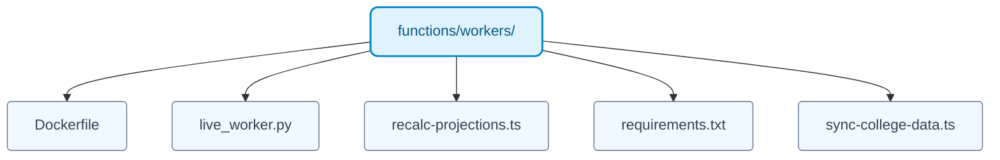

# Project Map — functions/workers

```mermaid
flowchart TB
  classDef folder fill:#e0f2fe,stroke:#0284c7,stroke-width:2,color:#075985,rx:8,ry:8
  classDef file fill:#f0f9ff,stroke:#64748b,stroke-width:1,color:#334155,rx:4,ry:4
  functions_workers["functions/workers/" ]
  class functions_workers folder
  functions_workers_Dockerfile["Dockerfile"]
  class functions_workers_Dockerfile file
  functions_workers --> functions_workers_Dockerfile
  functions_workers_live_worker_py["live_worker.py"]
  class functions_workers_live_worker_py file
  functions_workers --> functions_workers_live_worker_py
  functions_workers_recalc_projections_ts["recalc-projections.ts"]
  class functions_workers_recalc_projections_ts file
  functions_workers --> functions_workers_recalc_projections_ts
  functions_workers_requirements_txt["requirements.txt"]
  class functions_workers_requirements_txt file
  functions_workers --> functions_workers_requirements_txt
  functions_workers_sync_college_data_ts["sync-college-data.ts"]
  class functions_workers_sync_college_data_ts file
  functions_workers --> functions_workers_sync_college_data_ts
```
