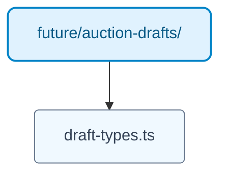

# Project Map — future/auction-drafts

```mermaid
flowchart TB
  classDef folder fill:#e0f2fe,stroke:#0284c7,stroke-width:2,color:#075985,rx:8,ry:8
  classDef file fill:#f0f9ff,stroke:#64748b,stroke-width:1,color:#334155,rx:4,ry:4
  future_auction_drafts["future/auction-drafts/" ]
  class future_auction_drafts folder
  future_auction_drafts_draft_types_ts["draft-types.ts"]
  class future_auction_drafts_draft_types_ts file
  future_auction_drafts --> future_auction_drafts_draft_types_ts
```
