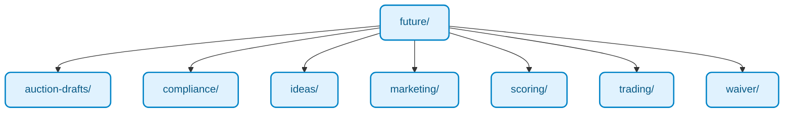

# Project Map — future

```mermaid
flowchart TB
  classDef folder fill:#e0f2fe,stroke:#0284c7,stroke-width:2,color:#075985,rx:8,ry:8
  classDef file fill:#f0f9ff,stroke:#64748b,stroke-width:1,color:#334155,rx:4,ry:4
  R["future/"]
  class R folder
  future_auction_drafts_["auction-drafts/"]
  class future_auction_drafts_ folder
  R --> future_auction_drafts_
  click future_auction_drafts_ "/admin/project-map/future/auction-drafts" "Open auction-drafts"
  future_compliance_["compliance/"]
  class future_compliance_ folder
  R --> future_compliance_
  click future_compliance_ "/admin/project-map/future/compliance" "Open compliance"
  future_ideas_["ideas/"]
  class future_ideas_ folder
  R --> future_ideas_
  click future_ideas_ "/admin/project-map/future/ideas" "Open ideas"
  future_marketing_["marketing/"]
  class future_marketing_ folder
  R --> future_marketing_
  click future_marketing_ "/admin/project-map/future/marketing" "Open marketing"
  future_scoring_["scoring/"]
  class future_scoring_ folder
  R --> future_scoring_
  click future_scoring_ "/admin/project-map/future/scoring" "Open scoring"
  future_trading_["trading/"]
  class future_trading_ folder
  R --> future_trading_
  click future_trading_ "/admin/project-map/future/trading" "Open trading"
  future_waiver_["waiver/"]
  class future_waiver_ folder
  R --> future_waiver_
  click future_waiver_ "/admin/project-map/future/waiver" "Open waiver"
```
