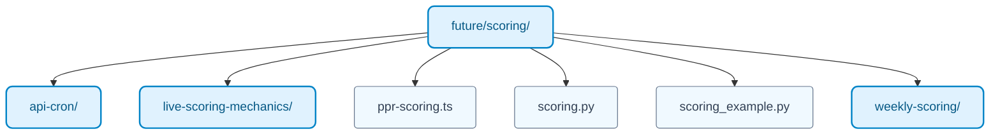

# Project Map — future/scoring

```mermaid
flowchart TB
  classDef folder fill:#e0f2fe,stroke:#0284c7,stroke-width:2,color:#075985,rx:8,ry:8
  classDef file fill:#f0f9ff,stroke:#64748b,stroke-width:1,color:#334155,rx:4,ry:4
  future_scoring["future/scoring/" ]
  class future_scoring folder
  future_scoring_api_cron["api-cron/"]
  class future_scoring_api_cron folder
  future_scoring --> future_scoring_api_cron
  click future_scoring_api_cron "/admin/project-map/future/scoring/api-cron" "Open api-cron"
  future_scoring_live_scoring_mechanics["live-scoring-mechanics/"]
  class future_scoring_live_scoring_mechanics folder
  future_scoring --> future_scoring_live_scoring_mechanics
  click future_scoring_live_scoring_mechanics "/admin/project-map/future/scoring/live-scoring-mechanics" "Open live-scoring-mechanics"
  future_scoring_ppr_scoring_ts["ppr-scoring.ts"]
  class future_scoring_ppr_scoring_ts file
  future_scoring --> future_scoring_ppr_scoring_ts
  future_scoring_scoring_py["scoring.py"]
  class future_scoring_scoring_py file
  future_scoring --> future_scoring_scoring_py
  future_scoring_scoring_example_py["scoring_example.py"]
  class future_scoring_scoring_example_py file
  future_scoring --> future_scoring_scoring_example_py
  future_scoring_weekly_scoring["weekly-scoring/"]
  class future_scoring_weekly_scoring folder
  future_scoring --> future_scoring_weekly_scoring
  click future_scoring_weekly_scoring "/admin/project-map/future/scoring/weekly-scoring" "Open weekly-scoring"
```
