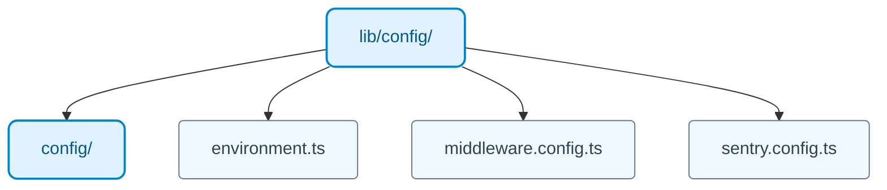

# Project Map — lib/config

```mermaid
flowchart TB
  classDef folder fill:#e0f2fe,stroke:#0284c7,stroke-width:2,color:#075985,rx:8,ry:8
  classDef file fill:#f0f9ff,stroke:#64748b,stroke-width:1,color:#334155,rx:4,ry:4
  lib_config["lib/config/" ]
  class lib_config folder
  lib_config_config["config/"]
  class lib_config_config folder
  lib_config --> lib_config_config
  click lib_config_config "/admin/project-map/lib/config/config" "Open config"
  lib_config_environment_ts["environment.ts"]
  class lib_config_environment_ts file
  lib_config --> lib_config_environment_ts
  lib_config_middleware_config_ts["middleware.config.ts"]
  class lib_config_middleware_config_ts file
  lib_config --> lib_config_middleware_config_ts
  lib_config_sentry_config_ts["sentry.config.ts"]
  class lib_config_sentry_config_ts file
  lib_config --> lib_config_sentry_config_ts
```
