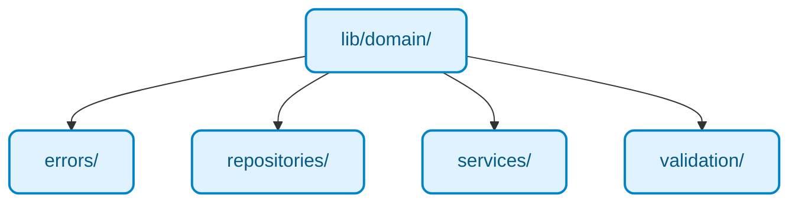

# Project Map — lib/domain

```mermaid
flowchart TB
  classDef folder fill:#e0f2fe,stroke:#0284c7,stroke-width:2,color:#075985,rx:8,ry:8
  classDef file fill:#f0f9ff,stroke:#64748b,stroke-width:1,color:#334155,rx:4,ry:4
  lib_domain["lib/domain/" ]
  class lib_domain folder
  lib_domain_errors["errors/"]
  class lib_domain_errors folder
  lib_domain --> lib_domain_errors
  click lib_domain_errors "/admin/project-map/lib/domain/errors" "Open errors"
  lib_domain_repositories["repositories/"]
  class lib_domain_repositories folder
  lib_domain --> lib_domain_repositories
  click lib_domain_repositories "/admin/project-map/lib/domain/repositories" "Open repositories"
  lib_domain_services["services/"]
  class lib_domain_services folder
  lib_domain --> lib_domain_services
  click lib_domain_services "/admin/project-map/lib/domain/services" "Open services"
  lib_domain_validation["validation/"]
  class lib_domain_validation folder
  lib_domain --> lib_domain_validation
  click lib_domain_validation "/admin/project-map/lib/domain/validation" "Open validation"
```
