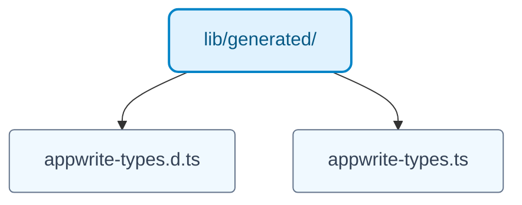

# Project Map — lib/generated

```mermaid
flowchart TB
  classDef folder fill:#e0f2fe,stroke:#0284c7,stroke-width:2,color:#075985,rx:8,ry:8
  classDef file fill:#f0f9ff,stroke:#64748b,stroke-width:1,color:#334155,rx:4,ry:4
  lib_generated["lib/generated/" ]
  class lib_generated folder
  lib_generated_appwrite_types_d_ts["appwrite-types.d.ts"]
  class lib_generated_appwrite_types_d_ts file
  lib_generated --> lib_generated_appwrite_types_d_ts
  lib_generated_appwrite_types_ts["appwrite-types.ts"]
  class lib_generated_appwrite_types_ts file
  lib_generated --> lib_generated_appwrite_types_ts
```
