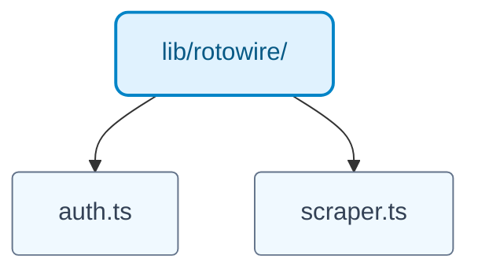

# Project Map — lib/rotowire

```mermaid
flowchart TB
  classDef folder fill:#e0f2fe,stroke:#0284c7,stroke-width:2,color:#075985,rx:8,ry:8
  classDef file fill:#f0f9ff,stroke:#64748b,stroke-width:1,color:#334155,rx:4,ry:4
  lib_rotowire["lib/rotowire/" ]
  class lib_rotowire folder
  lib_rotowire_auth_ts["auth.ts"]
  class lib_rotowire_auth_ts file
  lib_rotowire --> lib_rotowire_auth_ts
  lib_rotowire_scraper_ts["scraper.ts"]
  class lib_rotowire_scraper_ts file
  lib_rotowire --> lib_rotowire_scraper_ts
```
