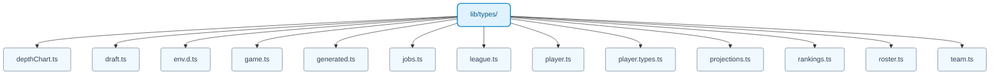

# Project Map — lib/types

```mermaid
flowchart TB
  classDef folder fill:#e0f2fe,stroke:#0284c7,stroke-width:2,color:#075985,rx:8,ry:8
  classDef file fill:#f0f9ff,stroke:#64748b,stroke-width:1,color:#334155,rx:4,ry:4
  lib_types["lib/types/" ]
  class lib_types folder
  lib_types_depthChart_ts["depthChart.ts"]
  class lib_types_depthChart_ts file
  lib_types --> lib_types_depthChart_ts
  lib_types_draft_ts["draft.ts"]
  class lib_types_draft_ts file
  lib_types --> lib_types_draft_ts
  lib_types_env_d_ts["env.d.ts"]
  class lib_types_env_d_ts file
  lib_types --> lib_types_env_d_ts
  lib_types_game_ts["game.ts"]
  class lib_types_game_ts file
  lib_types --> lib_types_game_ts
  lib_types_generated_ts["generated.ts"]
  class lib_types_generated_ts file
  lib_types --> lib_types_generated_ts
  lib_types_jobs_ts["jobs.ts"]
  class lib_types_jobs_ts file
  lib_types --> lib_types_jobs_ts
  lib_types_league_ts["league.ts"]
  class lib_types_league_ts file
  lib_types --> lib_types_league_ts
  lib_types_player_ts["player.ts"]
  class lib_types_player_ts file
  lib_types --> lib_types_player_ts
  lib_types_player_types_ts["player.types.ts"]
  class lib_types_player_types_ts file
  lib_types --> lib_types_player_types_ts
  lib_types_projections_ts["projections.ts"]
  class lib_types_projections_ts file
  lib_types --> lib_types_projections_ts
  lib_types_rankings_ts["rankings.ts"]
  class lib_types_rankings_ts file
  lib_types --> lib_types_rankings_ts
  lib_types_roster_ts["roster.ts"]
  class lib_types_roster_ts file
  lib_types --> lib_types_roster_ts
  lib_types_team_ts["team.ts"]
  class lib_types_team_ts file
  lib_types --> lib_types_team_ts
```
