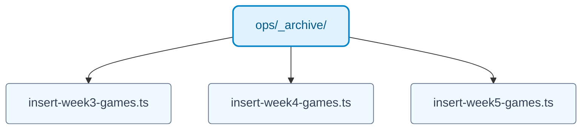

# Project Map — ops/_archive

```mermaid
flowchart TB
  classDef folder fill:#e0f2fe,stroke:#0284c7,stroke-width:2,color:#075985,rx:8,ry:8
  classDef file fill:#f0f9ff,stroke:#64748b,stroke-width:1,color:#334155,rx:4,ry:4
  ops__archive["ops/_archive/" ]
  class ops__archive folder
  ops__archive_insert_week3_games_ts["insert-week3-games.ts"]
  class ops__archive_insert_week3_games_ts file
  ops__archive --> ops__archive_insert_week3_games_ts
  ops__archive_insert_week4_games_ts["insert-week4-games.ts"]
  class ops__archive_insert_week4_games_ts file
  ops__archive --> ops__archive_insert_week4_games_ts
  ops__archive_insert_week5_games_ts["insert-week5-games.ts"]
  class ops__archive_insert_week5_games_ts file
  ops__archive --> ops__archive_insert_week5_games_ts
```
