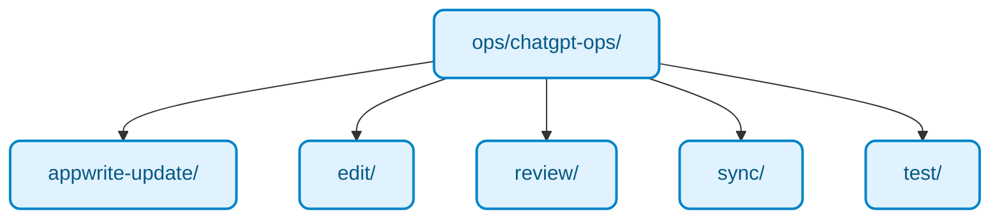

# Project Map — ops/chatgpt-ops

```mermaid
flowchart TB
  classDef folder fill:#e0f2fe,stroke:#0284c7,stroke-width:2,color:#075985,rx:8,ry:8
  classDef file fill:#f0f9ff,stroke:#64748b,stroke-width:1,color:#334155,rx:4,ry:4
  ops_chatgpt_ops["ops/chatgpt-ops/" ]
  class ops_chatgpt_ops folder
  ops_chatgpt_ops_appwrite_update["appwrite-update/"]
  class ops_chatgpt_ops_appwrite_update folder
  ops_chatgpt_ops --> ops_chatgpt_ops_appwrite_update
  click ops_chatgpt_ops_appwrite_update "/admin/project-map/ops/chatgpt-ops/appwrite-update" "Open appwrite-update"
  ops_chatgpt_ops_edit["edit/"]
  class ops_chatgpt_ops_edit folder
  ops_chatgpt_ops --> ops_chatgpt_ops_edit
  click ops_chatgpt_ops_edit "/admin/project-map/ops/chatgpt-ops/edit" "Open edit"
  ops_chatgpt_ops_review["review/"]
  class ops_chatgpt_ops_review folder
  ops_chatgpt_ops --> ops_chatgpt_ops_review
  click ops_chatgpt_ops_review "/admin/project-map/ops/chatgpt-ops/review" "Open review"
  ops_chatgpt_ops_sync["sync/"]
  class ops_chatgpt_ops_sync folder
  ops_chatgpt_ops --> ops_chatgpt_ops_sync
  click ops_chatgpt_ops_sync "/admin/project-map/ops/chatgpt-ops/sync" "Open sync"
  ops_chatgpt_ops_test["test/"]
  class ops_chatgpt_ops_test folder
  ops_chatgpt_ops --> ops_chatgpt_ops_test
  click ops_chatgpt_ops_test "/admin/project-map/ops/chatgpt-ops/test" "Open test"
```
