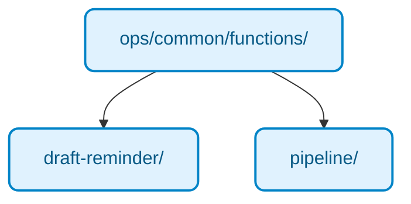

# Project Map — ops/common/functions

```mermaid
flowchart TB
  classDef folder fill:#e0f2fe,stroke:#0284c7,stroke-width:2,color:#075985,rx:8,ry:8
  classDef file fill:#f0f9ff,stroke:#64748b,stroke-width:1,color:#334155,rx:4,ry:4
  ops_common_functions["ops/common/functions/" ]
  class ops_common_functions folder
  ops_common_functions_draft_reminder["draft-reminder/"]
  class ops_common_functions_draft_reminder folder
  ops_common_functions --> ops_common_functions_draft_reminder
  ops_common_functions_pipeline["pipeline/"]
  class ops_common_functions_pipeline folder
  ops_common_functions --> ops_common_functions_pipeline
```
