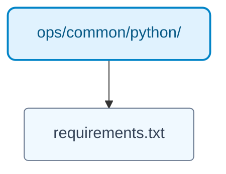

# Project Map — ops/common/python

```mermaid
flowchart TB
  classDef folder fill:#e0f2fe,stroke:#0284c7,stroke-width:2,color:#075985,rx:8,ry:8
  classDef file fill:#f0f9ff,stroke:#64748b,stroke-width:1,color:#334155,rx:4,ry:4
  ops_common_python["ops/common/python/" ]
  class ops_common_python folder
  ops_common_python_requirements_txt["requirements.txt"]
  class ops_common_python_requirements_txt file
  ops_common_python --> ops_common_python_requirements_txt
```
