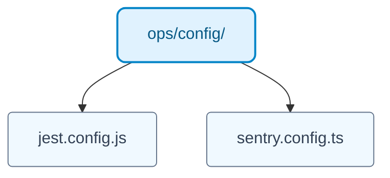

# Project Map — ops/config

```mermaid
flowchart TB
  classDef folder fill:#e0f2fe,stroke:#0284c7,stroke-width:2,color:#075985,rx:8,ry:8
  classDef file fill:#f0f9ff,stroke:#64748b,stroke-width:1,color:#334155,rx:4,ry:4
  ops_config["ops/config/" ]
  class ops_config folder
  ops_config_jest_config_js["jest.config.js"]
  class ops_config_jest_config_js file
  ops_config --> ops_config_jest_config_js
  ops_config_sentry_config_ts["sentry.config.ts"]
  class ops_config_sentry_config_ts file
  ops_config --> ops_config_sentry_config_ts
```
