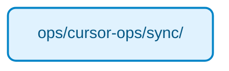

# Project Map — ops/cursor-ops/sync

```mermaid
flowchart TB
  classDef folder fill:#e0f2fe,stroke:#0284c7,stroke-width:2,color:#075985,rx:8,ry:8
  classDef file fill:#f0f9ff,stroke:#64748b,stroke-width:1,color:#334155,rx:4,ry:4
  ops_cursor_ops_sync["ops/cursor-ops/sync/" ]
  class ops_cursor_ops_sync folder
```
