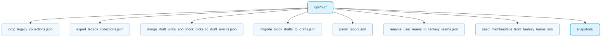

# Project Map — ops/out

```mermaid
flowchart TB
  classDef folder fill:#e0f2fe,stroke:#0284c7,stroke-width:2,color:#075985,rx:8,ry:8
  classDef file fill:#f0f9ff,stroke:#64748b,stroke-width:1,color:#334155,rx:4,ry:4
  ops_out["ops/out/" ]
  class ops_out folder
  ops_out_drop_legacy_collections_json["drop_legacy_collections.json"]
  class ops_out_drop_legacy_collections_json file
  ops_out --> ops_out_drop_legacy_collections_json
  ops_out_export_legacy_collections_json["export_legacy_collections.json"]
  class ops_out_export_legacy_collections_json file
  ops_out --> ops_out_export_legacy_collections_json
  ops_out_merge_draft_picks_and_mock_picks_to_draft_events_json["merge_draft_picks_and_mock_picks_to_draft_events.json"]
  class ops_out_merge_draft_picks_and_mock_picks_to_draft_events_json file
  ops_out --> ops_out_merge_draft_picks_and_mock_picks_to_draft_events_json
  ops_out_migrate_mock_drafts_to_drafts_json["migrate_mock_drafts_to_drafts.json"]
  class ops_out_migrate_mock_drafts_to_drafts_json file
  ops_out --> ops_out_migrate_mock_drafts_to_drafts_json
  ops_out_parity_report_json["parity_report.json"]
  class ops_out_parity_report_json file
  ops_out --> ops_out_parity_report_json
  ops_out_rename_user_teams_to_fantasy_teams_json["rename_user_teams_to_fantasy_teams.json"]
  class ops_out_rename_user_teams_to_fantasy_teams_json file
  ops_out --> ops_out_rename_user_teams_to_fantasy_teams_json
  ops_out_seed_memberships_from_fantasy_teams_json["seed_memberships_from_fantasy_teams.json"]
  class ops_out_seed_memberships_from_fantasy_teams_json file
  ops_out --> ops_out_seed_memberships_from_fantasy_teams_json
  ops_out_snapshots["snapshots/"]
  class ops_out_snapshots folder
  ops_out --> ops_out_snapshots
  click ops_out_snapshots "/admin/project-map/ops/out/snapshots" "Open snapshots"
```
