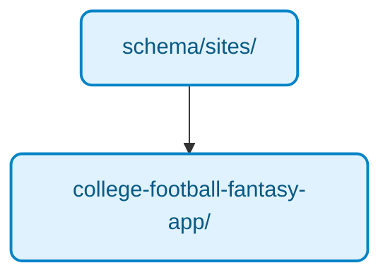

# Project Map — schema/sites

```mermaid
flowchart TB
  classDef folder fill:#e0f2fe,stroke:#0284c7,stroke-width:2,color:#075985,rx:8,ry:8
  classDef file fill:#f0f9ff,stroke:#64748b,stroke-width:1,color:#334155,rx:4,ry:4
  schema_sites["schema/sites/" ]
  class schema_sites folder
  schema_sites_college_football_fantasy_app["college-football-fantasy-app/"]
  class schema_sites_college_football_fantasy_app folder
  schema_sites --> schema_sites_college_football_fantasy_app
  click schema_sites_college_football_fantasy_app "/admin/project-map/schema/sites/college-football-fantasy-app" "Open college-football-fantasy-app"
```
