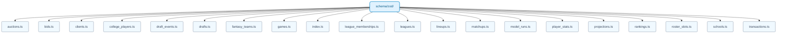

# Project Map — schema/zod

```mermaid
flowchart TB
  classDef folder fill:#e0f2fe,stroke:#0284c7,stroke-width:2,color:#075985,rx:8,ry:8
  classDef file fill:#f0f9ff,stroke:#64748b,stroke-width:1,color:#334155,rx:4,ry:4
  schema_zod["schema/zod/" ]
  class schema_zod folder
  schema_zod_auctions_ts["auctions.ts"]
  class schema_zod_auctions_ts file
  schema_zod --> schema_zod_auctions_ts
  schema_zod_bids_ts["bids.ts"]
  class schema_zod_bids_ts file
  schema_zod --> schema_zod_bids_ts
  schema_zod_clients_ts["clients.ts"]
  class schema_zod_clients_ts file
  schema_zod --> schema_zod_clients_ts
  schema_zod_college_players_ts["college_players.ts"]
  class schema_zod_college_players_ts file
  schema_zod --> schema_zod_college_players_ts
  schema_zod_draft_events_ts["draft_events.ts"]
  class schema_zod_draft_events_ts file
  schema_zod --> schema_zod_draft_events_ts
  schema_zod_drafts_ts["drafts.ts"]
  class schema_zod_drafts_ts file
  schema_zod --> schema_zod_drafts_ts
  schema_zod_fantasy_teams_ts["fantasy_teams.ts"]
  class schema_zod_fantasy_teams_ts file
  schema_zod --> schema_zod_fantasy_teams_ts
  schema_zod_games_ts["games.ts"]
  class schema_zod_games_ts file
  schema_zod --> schema_zod_games_ts
  schema_zod_index_ts["index.ts"]
  class schema_zod_index_ts file
  schema_zod --> schema_zod_index_ts
  schema_zod_league_memberships_ts["league_memberships.ts"]
  class schema_zod_league_memberships_ts file
  schema_zod --> schema_zod_league_memberships_ts
  schema_zod_leagues_ts["leagues.ts"]
  class schema_zod_leagues_ts file
  schema_zod --> schema_zod_leagues_ts
  schema_zod_lineups_ts["lineups.ts"]
  class schema_zod_lineups_ts file
  schema_zod --> schema_zod_lineups_ts
  schema_zod_matchups_ts["matchups.ts"]
  class schema_zod_matchups_ts file
  schema_zod --> schema_zod_matchups_ts
  schema_zod_model_runs_ts["model_runs.ts"]
  class schema_zod_model_runs_ts file
  schema_zod --> schema_zod_model_runs_ts
  schema_zod_player_stats_ts["player_stats.ts"]
  class schema_zod_player_stats_ts file
  schema_zod --> schema_zod_player_stats_ts
  schema_zod_projections_ts["projections.ts"]
  class schema_zod_projections_ts file
  schema_zod --> schema_zod_projections_ts
  schema_zod_rankings_ts["rankings.ts"]
  class schema_zod_rankings_ts file
  schema_zod --> schema_zod_rankings_ts
  schema_zod_roster_slots_ts["roster_slots.ts"]
  class schema_zod_roster_slots_ts file
  schema_zod --> schema_zod_roster_slots_ts
  schema_zod_schools_ts["schools.ts"]
  class schema_zod_schools_ts file
  schema_zod --> schema_zod_schools_ts
  schema_zod_transactions_ts["transactions.ts"]
  class schema_zod_transactions_ts file
  schema_zod --> schema_zod_transactions_ts
```
