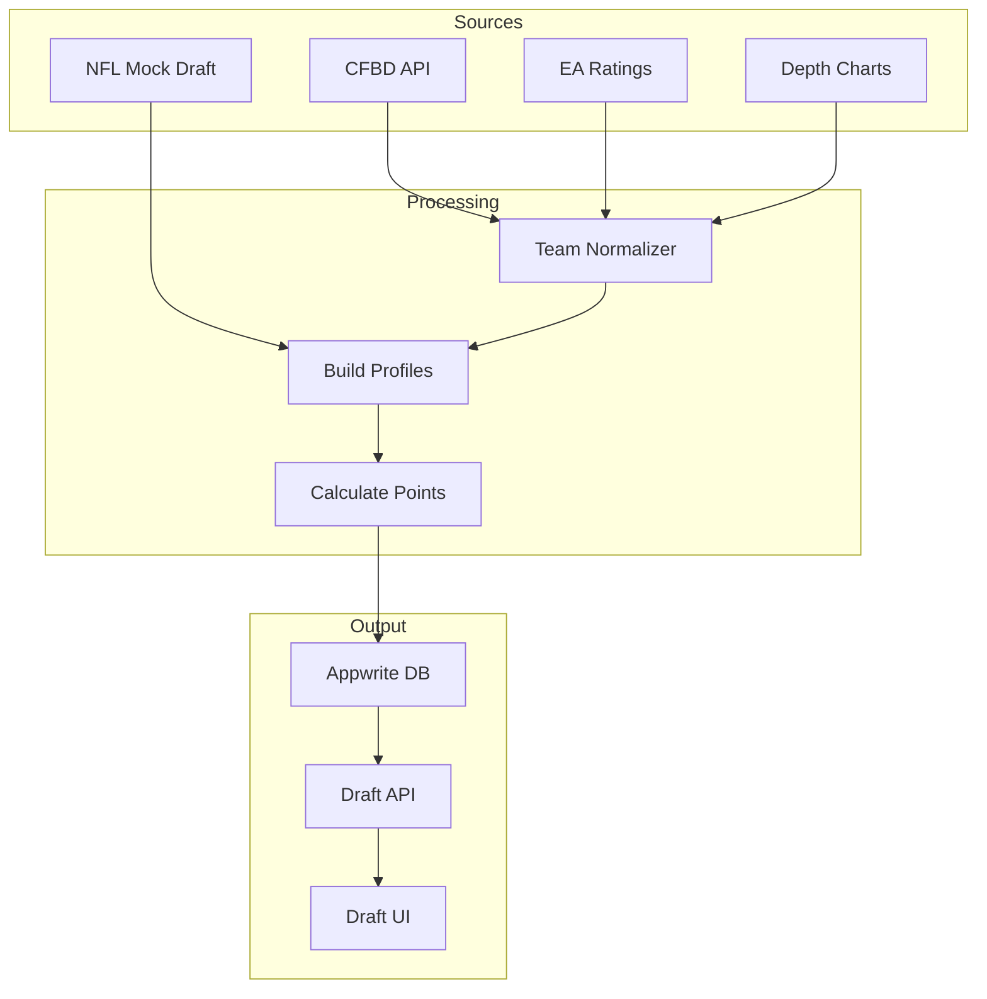

# Projections System Overview

```mermaid
flowchart TB
    subgraph Sources
        CFBD[CFBD API]
        EA[EA Ratings]
        DC[Depth Charts]
        NFL[NFL Mock Draft]
    end
    
    subgraph Processing
        NORM[Team Normalizer]
        BUILD[Build Profiles]
        CALC[Calculate Points]
    end
    
    subgraph Output
        DB[Appwrite DB]
        API[Draft API]
        UI[Draft UI]
    end
    
    CFBD --> NORM
    EA --> NORM
    DC --> NORM
    NFL --> BUILD
    NORM --> BUILD
    BUILD --> CALC
    CALC --> DB
    DB --> API
    API --> UI
```
