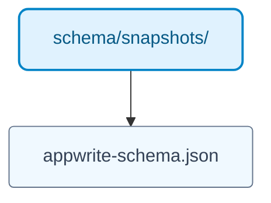

# Project Map — schema/snapshots

```mermaid
flowchart TB
  classDef folder fill:#e0f2fe,stroke:#0284c7,stroke-width:2,color:#075985,rx:8,ry:8
  classDef file fill:#f0f9ff,stroke:#64748b,stroke-width:1,color:#334155,rx:4,ry:4
  schema_snapshots["schema/snapshots/" ]
  class schema_snapshots folder
  schema_snapshots_appwrite_schema_json["appwrite-schema.json"]
  class schema_snapshots_appwrite_schema_json file
  schema_snapshots --> schema_snapshots_appwrite_schema_json
```
