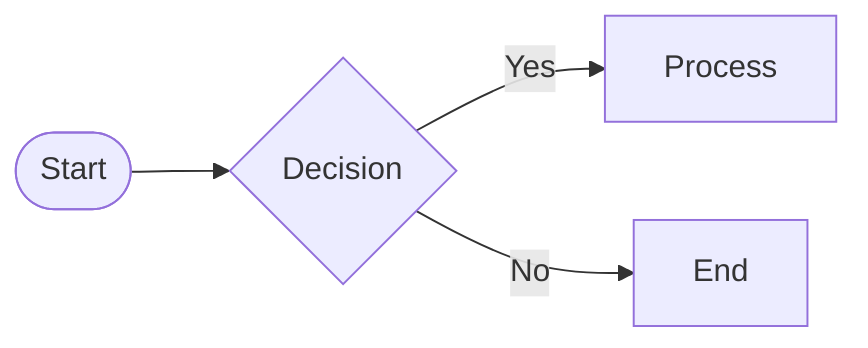

# Diagrams — Authoring & Lucid Editing Guide

This repo renders Mermaid diagrams in Admin and allows one‑click export to Lucid for editing.

## Authoring rules
- Place diagrams under `docs/diagrams/**`.
- Prefer these areas:
  - User journeys: `docs/diagrams/user-journeys/*.md`
  - Entity relations: `docs/diagrams/entity-relations/*.md`
  - Directory map: `docs/diagrams/directory-map/**/*.md`
  - System architecture: `docs/diagrams/system-architecture/*.md`
- Put your Mermaid in fenced blocks:

- Keep each diagram ≤120 lines where possible. For multi‑page docs, split into multiple Mermaid blocks in the same file (they render separately in Admin).
- Use left‑to‑right flows for user journeys; include a small legend (terminator/decision/process) per our standard.

## File naming and slugs
Every diagram file can be opened via an Admin slug. The API resolves slugs to files.
- Examples:
  - `user-journeys:auth-user-flow` → `docs/diagrams/user-journeys/auth-user-flow.md`
  - `entity-relations:draft-entity-relation` → `docs/diagrams/entity-relations/draft-entity-relation.md`
  - `directory-map:chapters:app` → `docs/diagrams/directory-map/chapters/app.md`

Open by slug:
- Admin viewer: `/admin/diagrams/<slug>`
- Diagrams list pages exist for User Journeys, Entity Relations, Directory Map, Draft, Site Map.

## Open in Lucid (edit visually)
You can send any diagram to Lucid:
1. Open the diagram in Admin (e.g., `/admin/diagrams/user-journeys:auth-user-flow`).
2. Click “Open in Lucid” on the list card, or POST to `/api/lucid/import` with `{ slug, title }`.
3. The system converts Mermaid blocks into a Lucid Standard Import and opens the doc URL.

Requirements:
- Connect Lucid once from Admin → Diagrams hub (“Connect Lucid”) to store an access token.
- The importer posts the `.standardImport` payload to `https://api.lucid.co/documents`.

Notes:
- Import is one‑way; after editing in Lucid, export images/SVGs back if you want static assets.
- Keep the canonical source in Mermaid where possible so one‑click export stays accurate.

## Troubleshooting
- “No content available”: The file has no Mermaid blocks and no plain markdown body. Add a fenced `mermaid` block or regular markdown.
- “Lucid not connected”: Use the “Connect Lucid” button in Admin to authorize.
- Large diagrams: Split into multiple blocks; Admin renders each block as its own canvas with pan/zoom.
