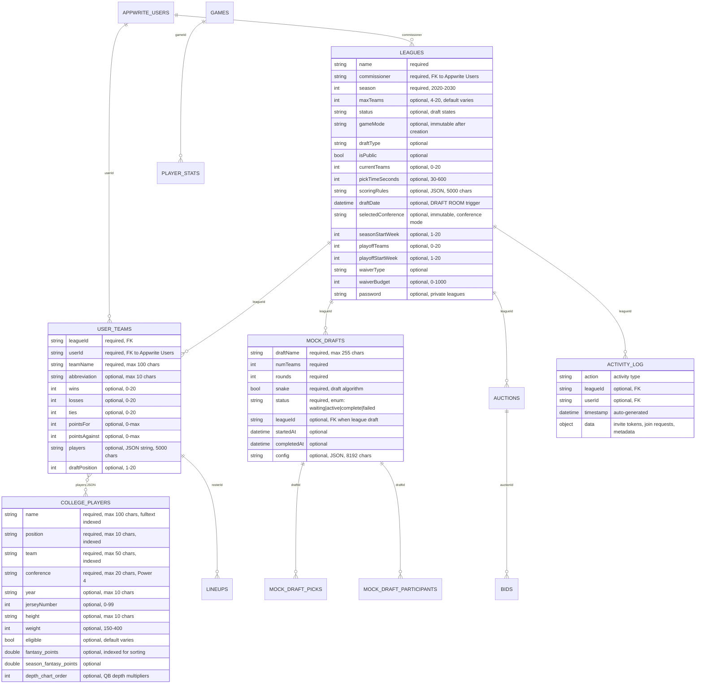

# System Map (Features, Routes, Collections)

## Collections (from Live Appwrite Database) ✅ Updated Aug 20, 2025

### Core Collections (Live Schema)
- **leagues**: required → `name`, `commissioner`, `season`
  - Optional → `maxTeams` (4-20), `status`, `gameMode`, `draftType`, `isPublic`, `currentTeams`, `pickTimeSeconds` (30-600), `scoringRules`, `draftDate` (datetime - DRAFT ROOM trigger), `selectedConference` (conference mode), `seasonStartWeek` (1-20), `playoffTeams` (0-20), `playoffStartWeek` (1-20), `waiverType`, `waiverBudget` (0-1000), `password`
- **user_teams**: required → `leagueId`, `userId`, `teamName`
  - Optional → `abbreviation`, `wins`, `losses`, `ties`, `pointsFor`, `pointsAgainst`, `players` (JSON string), `draftPosition` (1-20)
  - Indexes: league_idx, user_idx
- **college_players**: required → `name`, `position`, `team`, `conference`
  - Optional → `year`, `jerseyNumber` (0-99), `height`, `weight` (150-400), `eligible`, `fantasy_points`, `season_fantasy_points`, `depth_chart_order`
  - Indexes: position_idx, team_idx, points_idx, name_search (fulltext)
- **games**: required → `week`, `season`, `season_type`, `home_team`, `away_team`, `start_date`
- **rankings**: required → `week`, `season`, `poll_type`, `team`, `rank`
  - Optional → `points`, `first_place_votes`

### Draft System Collections (Live Schema)
- **mock_drafts**: required → `draftName`, `numTeams`, `rounds`, `snake`, `status`
  - Optional → `leagueId`, `startedAt`, `completedAt`, `config` (JSON)
  - Status enum: ["waiting", "active", "complete", "failed"]
- **mock_draft_picks**: snake draft picks with real-time updates
- **mock_draft_participants**: participant management system

### Fantasy Collections (From Database)
- **lineups**: weekly roster management
- **auctions**: auction draft sessions
- **bids**: auction bidding system
- **player_stats**: game performance data
- **activity_log**: league activity tracking with invite tokens

### Auth & Users (Appwrite Built-in)
- **Appwrite Auth Users**: 11 active users currently registered
  - OAuth integration ready (Google, Apple)
  - Session management with secure cookies
  - Email verification and MFA support available

## Feature → Routes → Collections (high-level)

- Auth: signup/login/logout/profile → `users`
- Create League → `leagues`, `user_teams`
- League Details/My Leagues → `leagues`, `user_teams`, `users`
- Locker Room → `leagues`, `user_teams`, `college_players`, `users`
- Roster Detail/Lineup → `user_teams`
- Draft Status/Pick → `leagues`, `draft_picks`, `user_teams`, `activity_log`
- Players (Enhanced) → `college_players`
- Projections → `projections_yearly`, `projections_weekly` (db), `college_players` (calc)
- Games/Rankings → `games`, `rankings`
- Conferences → `teams`
- Weekly Scoring → `games`, `player_stats`, updates `lineups` and `user_teams`
- Admin (Dedupe/Refresh/Retire) → `college_players`

## Simplification/Alignment Checklist

- Define missing collections in SSOT: `draft_picks`, `mock_*`.
- Ensure docs say `user_teams` (not `rosters`) except when referring to legacy.
- Enforce Appwrite rule: required attributes must not have defaults; if defaults needed → make optional and set in code.
- Keep route shape normalized to camelCase fields.
