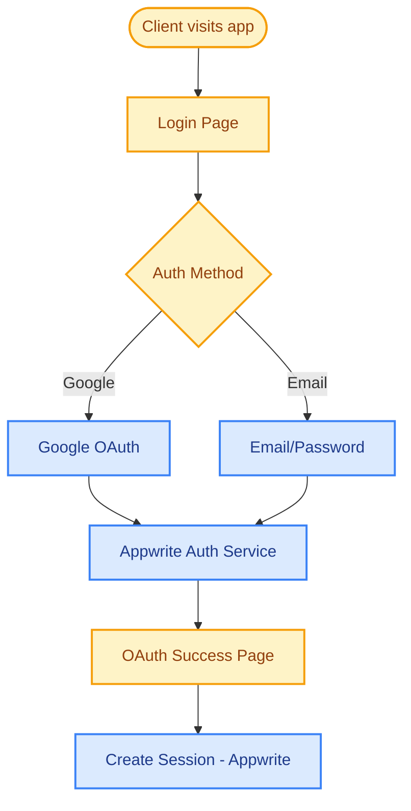

# DUPLICATE — Create Account Flow (snapshot)

```mermaid
%% Duplicate snapshot for archival
flowchart TB
  classDef client fill:#fef3c7,stroke:#f59e0b,stroke-width:2,color:#92400e
  classDef auth fill:#dbeafe,stroke:#3b82f6,stroke-width:2,color:#1e3a8a
  classDef db fill:#d1fae5,stroke:#10b981,stroke-width:2,color:#064e3b
  Start([Client visits app]):::client
  Login[Login Page]:::client
  Choice{Auth Method}:::client
  GoogleAuth[Google OAuth]:::auth
  EmailAuth[Email/Password]:::auth
  AppwriteAuth[Appwrite Auth Service]:::auth
  Callback[OAuth Success Page]:::client
  CreateSession[Create Session - Appwrite]:::auth
  Start --> Login --> Choice
  Choice -->|Google| GoogleAuth --> AppwriteAuth --> Callback --> CreateSession
  Choice -->|Email| EmailAuth --> AppwriteAuth
```
