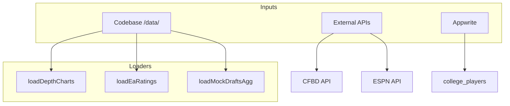

# DUPLICATE — Projections System Overview (snapshot)

```mermaid
%% Duplicate snapshot for archival
flowchart TB
  subgraph Inputs
    CS[Codebase /data/]
    EA[External APIs]
    AW[Appwrite]
  end
  subgraph Loaders
    L1[loadDepthCharts]
    L2[loadEaRatings]
    L3[loadMockDraftsAgg]
  end
  CS --> L1
  CS --> L2
  CS --> L3
  EA --> CFBD[CFBD API]
  EA --> ESPN[ESPN API]
  AW --> CP[college_players]
```
