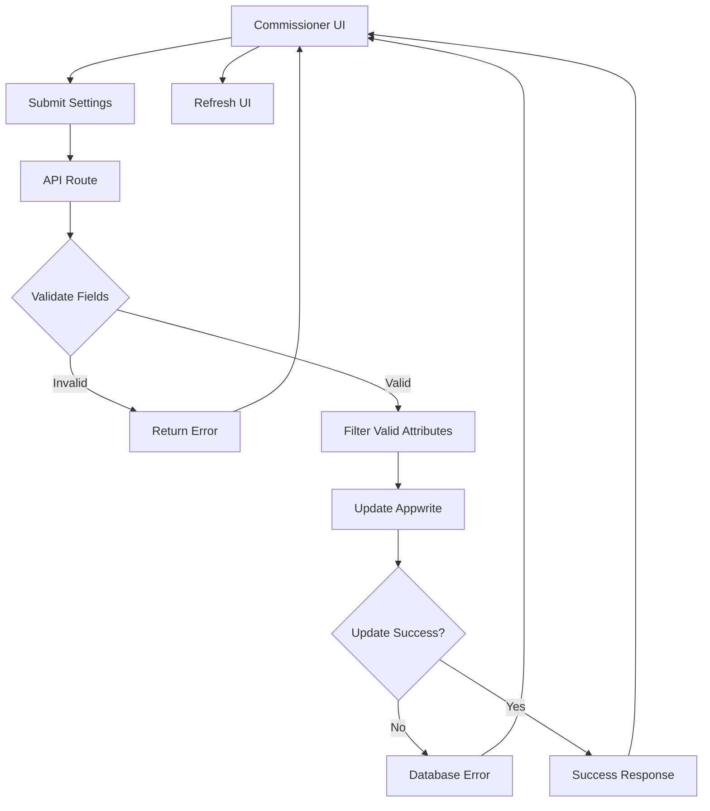

# Commissioner Settings Schema Fix Flow

```mermaid
flowchart TD
    UI[Commissioner UI] --> SUBMIT[Submit Settings]
    SUBMIT --> API[API Route]
    
    API --> VALIDATE{Validate Fields}
    VALIDATE -->|Invalid| ERROR[Return Error]
    ERROR --> UI
    
    VALIDATE -->|Valid| FILTER[Filter Valid Attributes]
    FILTER --> UPDATE[Update Appwrite]
    
    UPDATE --> SUCCESS{Update Success?}
    SUCCESS -->|No| DB_ERROR[Database Error]
    DB_ERROR --> UI
    
    SUCCESS -->|Yes| RESPONSE[Success Response]
    RESPONSE --> UI
    
    UI --> REFRESH[Refresh UI]
```
