# External Providers Map

## Provider Overview

```mermaid
graph TB
  CFBD[CFBD]
  CFBD --> MCFBD0[pagex]
  CFBD --> MCFBD1[pagex]
  CFBD --> MCFBD2[route]
  CFBD --> MCFBD3[route]
  CFBD --> MCFBD4[route]
  CFBD --> MCFBD5[route]
  CFBD --> MCFBD6[route]
  CFBD --> MCFBD7[route]
  CFBD --> MCFBD8[route]
  CFBD --> MCFBD9[index]
  MCFBD0 --> CCFBD0[college_players]
  Anthropic[Anthropic]
  Anthropic --> MAnthropic0[pagex]
  Anthropic --> MAnthropic1[pagex]
  Anthropic --> MAnthropic2[pagex]
  Anthropic --> MAnthropic3[route]
  OpenAI[OpenAI]
  OpenAI --> MOpenAI0[pagex]
  OpenAI --> MOpenAI1[pagex]
  Google[Google]
  Google --> MGoogle0[pagex]
  Google --> MGoogle1[route]
  Google --> MGoogle2[route]
  Google --> MGoogle3[route]
  Google --> MGoogle4[route]
  Google --> MGoogle5[route]
  Google --> MGoogle6[route]
  Google --> MGoogle7[route]
  Rotowire[Rotowire]
  Rotowire --> MRotowire0[pagex]
  Rotowire --> MRotowire1[route]
  Rotowire --> MRotowire2[route]
  Rotowire --> MRotowire3[route]
  Rotowire --> MRotowire4[route]
  ESPN[ESPN]
  ESPN --> MESPN0[route]
  ESPN --> MESPN1[route]
  MESPN0 --> CESPN0[college_players]
```

## Provider Details

### CFBD

**Modules using this provider:**
- `app/admin/page.tsx`
- `app/(dashboard)/league/[leagueId]/locker-room/page.tsx`
- `app/api/(backend)/cron/data-sync/route.ts`
- `app/api/(external)/cfbd/players/route.ts`
- `app/api/(frontend)/players/cleanup/route.ts`
- `app/api/(frontend)/draft/players/route.ts`
- `app/api/(backend)/admin/players/refresh/route.ts`
- `app/api/(backend)/admin/players/cron-cleanup/route.ts`
- `app/api/(backend)/admin/players/export/route.ts`
- `functions/appwrite/import-players/index.ts`

**Collections influenced:**
- college_players

---

### Anthropic

**Modules using this provider:**
- `app/admin/page.tsx`
- `app/admin/product-vision/page.tsx`
- `app/(league)/launch/page.tsx`
- `app/api/(external)/claude/route.ts`

**Collections influenced:**

---

### OpenAI

**Modules using this provider:**
- `app/admin/page.tsx`
- `app/admin/product-vision/page.tsx`

**Collections influenced:**

---

### Google

**Modules using this provider:**
- `app/auth/callback/page.tsx`
- `app/api/lucid/health/route.ts`
- `app/api/lucid/callback/route.ts`
- `app/api/lucid/authorize/route.ts`
- `app/api/auth/oauth-callback/route.ts`
- `app/api/auth/google/route.ts`
- `app/api/lucid/oauth/start/route.ts`
- `app/api/lucid/oauth/callback/route.ts`

**Collections influenced:**

---

### Rotowire

**Modules using this provider:**
- `app/(dashboard)/league/[leagueId]/locker-room/page.tsx`
- `app/api/rotowire/route.ts`
- `app/api/rotowire/news/route.ts`
- `app/api/(backend)/cron/data-sync/route.ts`
- `app/api/(frontend)/players/cleanup/route.ts`

**Collections influenced:**

---

### ESPN

**Modules using this provider:**
- `app/api/scraper/route.ts`
- `app/api/(backend)/admin/players/survey-sec-nfl/route.ts`

**Collections influenced:**
- college_players

---

