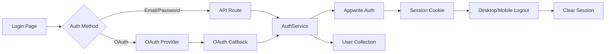

# Authentication Flow

```mermaid
flowchart LR
    A[Login Page] --> B{Auth Method}
    B -->|Email/Password| C[API Route]
    B -->|OAuth| D[OAuth Provider]
    C --> E[AuthService]
    D --> F[OAuth Callback]
    F --> E
    E --> G[Appwrite Auth]
    G --> H[Session Cookie]
    H --> I[Desktop/Mobile Logout]
    I --> J[Clear Session]
    E --> K[User Collection]
```
