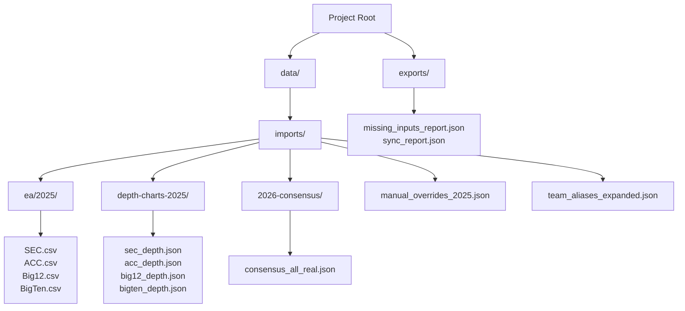

# Data Sources & Files

```mermaid
flowchart TD
    ROOT[Project Root]
    ROOT --> DATA[data/]
    DATA --> IMPORTS[imports/]
    
    IMPORTS --> EA[ea/2025/]
    EA --> EA_FILES[SEC.csv<br/>ACC.csv<br/>Big12.csv<br/>BigTen.csv]
    
    IMPORTS --> DC[depth-charts-2025/]
    DC --> DC_FILES[sec_depth.json<br/>acc_depth.json<br/>big12_depth.json<br/>bigten_depth.json]
    
    IMPORTS --> NFL[2026-consensus/]
    NFL --> CONSENSUS[consensus_all_real.json]
    
    IMPORTS --> OVERRIDES[manual_overrides_2025.json]
    IMPORTS --> ALIASES[team_aliases_expanded.json]
    
    ROOT --> EXPORTS[exports/]
    EXPORTS --> REPORTS[missing_inputs_report.json<br/>sync_report.json]
```
