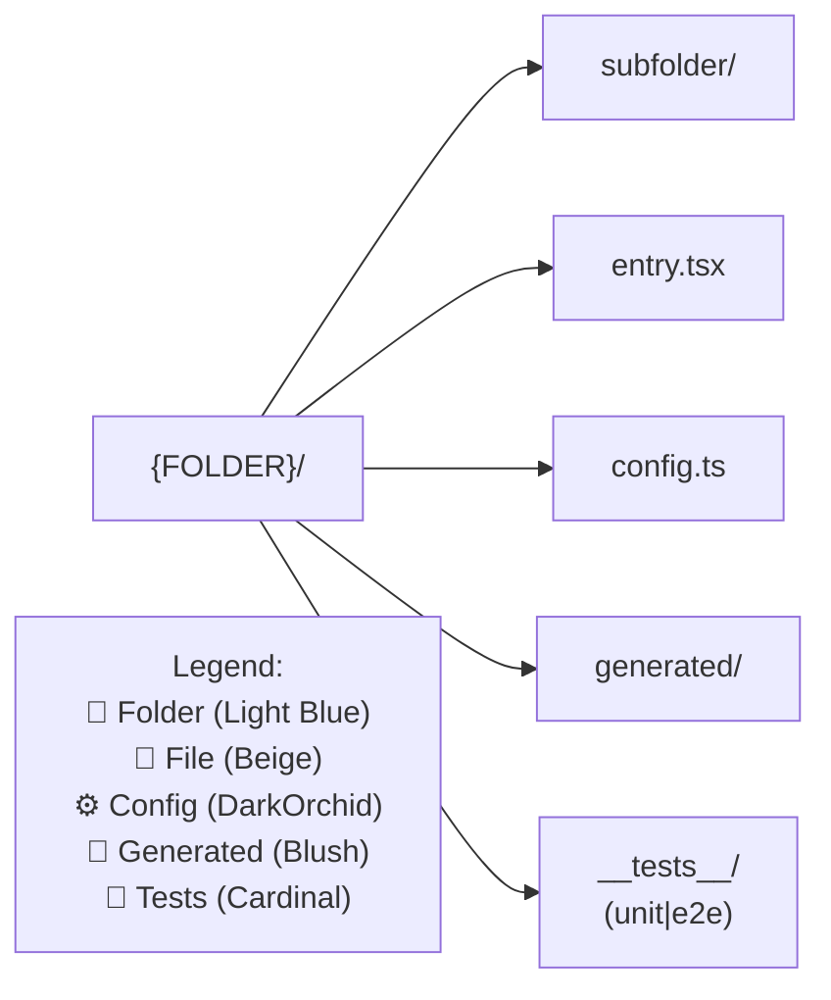
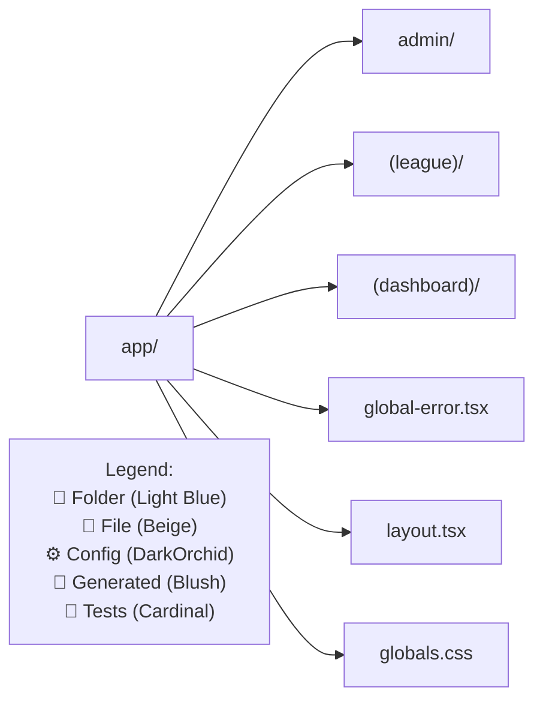
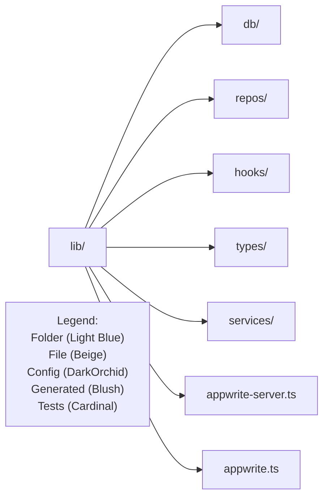

# Chapter: {FOLDER}/

**Purpose** — One‑liner on what lives here.
**Usage** — How to work in this folder; do’s & don’ts.
**Owner** — Team/role (optional).
**Build impact** — e.g., client bundle, server only, function runtime.

### Key files
- `path/to/file.tsx` — 1‑line why it matters
- `path/to/another.ts` — 1‑line why it matters

### Key subfolders
- `sub/` — what lives here
- `sub/feature/` — what lives here

### Diagram


---

## 4) Example — `chapters/app.md`
Use this as a concrete reference.

```markdown
# Chapter: app/

**Purpose** — Next.js App Router entry points, routes, and pages.
**Usage** — Prefer Server Components; only use Client Components for interactivity. Colocate route parts.
**Build impact** — Affects client/server bundles; beware of accidental client imports from `lib/**`.

### Key files
- `app/layout.tsx` — Root layout & metadata
- `app/globals.css` — Global styles
- `app/global-error.tsx` — Global error boundary (optional)

### Key subfolders
- `admin/` — Internal admin tools and viewers
- `(league)/` — League feature routes
- `(dashboard)/` — Dashboard routes

### Diagram

```

---

## 5) Example — `chapters/lib.md`
```markdown
# Chapter: lib/

**Purpose** — Core utilities, repositories, domain logic, SDKs.
**Usage** — Keep business logic here; avoid importing UI from `components/**`.
**Build impact** — Primarily server/runtime code; can be shared to functions.

### Key files (sample)
- `lib/appwrite-server.ts` — Server SDK client
- `lib/appwrite.ts` — Client SDK wrapper
- `lib/types/*` — Type models

### Key subfolders
- `db/` — database helpers
- `repos/` — repository pattern files
- `hooks/` — shared hooks (server/client)
- `services/` — domain services

### Diagram

```

---

## 6) Update the hub list page
**Prompt to Cursor**
- In `app/admin/diagrams/directory-map/page.tsx`, ensure the list includes the new chapters (`public`, `styles`, `tests`, `data`, `scripts`, `vendor`).

---

## 7) Lint for quality (optional but recommended)
**Prompt to Cursor**
- Extend your `diagrams:lint` script to verify each chapter diagram:
  - Contains the shared classDefs
  - Contains a `Legend[` node
  - Uses `flowchart` (no `mindmap`)
  - Quotes labels with `/` or `:`

---

## 8) Clickable links (optional)
- After each diagram block, add `click` directives that route to:
  - Admin file overlay: `/admin/open?path=<path>`
  - GitHub source: `https://github.com/<org>/<repo>/blob/main/<path>`
- Keep Admin’s Mermaid renderer with `securityLevel: 'loose'` and `htmlLabels: true`.

---

## 9) Workflow to keep things in sync
- New folder? Create a chapter file and add it to the hub list.
- New key file? Add to the “Key files” list and diagram.
- Breaking rename? Update both the bullets and the diagram node label.

---

**Done.** Use the examples above to fill out each chapter; the diagram and the “key files” list will live in the same page for quick scanning + visual context.
