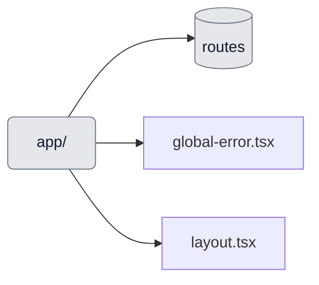

# Chapter: app/

- Purpose: Next.js App Router entry points, routes, and pages.
- Usage: Server Components by default; client components only where interactivity is required.
- Notes: Organize by route segments; colocate route-specific components; avoid data fetching in client components.

Key files:
- `app/layout.tsx` — Root layout
- `app/globals.css` — Global styles

