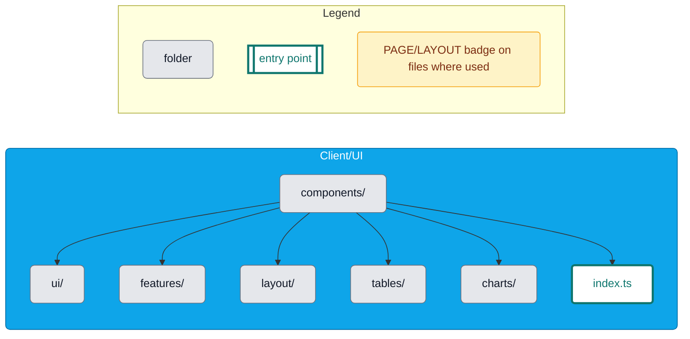

# Chapter: components/

- Purpose: Reusable UI pieces and feature-level components.
- Usage: Mirror target folder structure; prefer server-driven data into props; expose via `components/index.ts`.

Key subfolders: `ui/`, `features/`, `layout/`, `tables/`, `charts/`.

