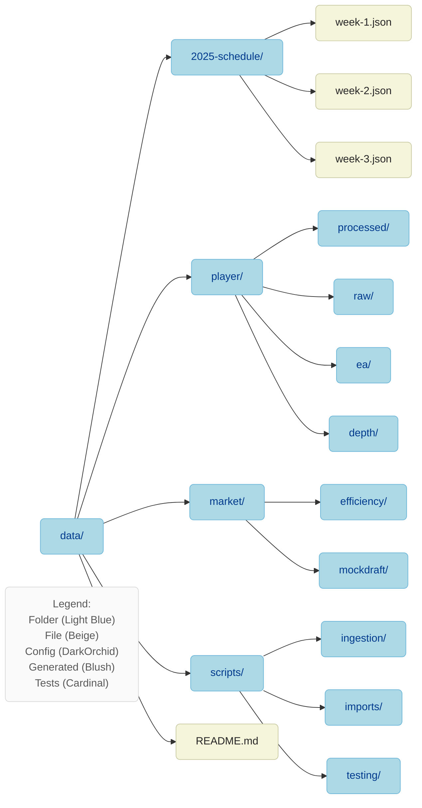

# Chapter: data/

- Purpose: Source and processed datasets for projections and models.
- Usage: Raw, processed, and scripts are organized by domain.

```mermaid
flowchart LR
%% Palette + legibility
classDef folder fill:#ADD8E6,stroke:#6CB6D9,color:#003A8C,rx:6,ry:6;
classDef file fill:#F5F5DC,stroke:#C9C9A3,color:#262626,rx:6,ry:6;
classDef config fill:#9932CC,stroke:#6E259B,color:#FFFFFF,rx:6,ry:6;
classDef generated fill:#DE5D83,stroke:#B34463,color:#FFFFFF,rx:6,ry:6;
classDef test fill:#C41E3A,stroke:#8E1F2E,color:#FFFFFF,rx:6,ry:6;
classDef legend fill:#FAFAFA,stroke:#D9D9D9,color:#595959,rx:6,ry:6;

D["data/"]:::folder --> D1["2025-schedule/"]:::folder
D --> D2["player/"]:::folder
D --> D3["market/"]:::folder
D --> D4["scripts/"]:::folder
D --> F0["README.md"]:::file
D1 --> F1["week-1.json"]:::file
D1 --> F2["week-2.json"]:::file
D1 --> F3["week-3.json"]:::file
D2 --> DP["processed/"]:::folder
D2 --> DR["raw/"]:::folder
D2 --> DE["ea/"]:::folder
D2 --> DD["depth/"]:::folder
D3 --> ME["efficiency/"]:::folder
D3 --> MM["mockdraft/"]:::folder
D4 --> S1["ingestion/"]:::folder
D4 --> S2["imports/"]:::folder
D4 --> S3["testing/"]:::folder

Legend["Legend:\nFolder (Light Blue)\nFile (Beige)\n Config (DarkOrchid)\n Generated (Blush)\nTests (Cardinal)"]:::legend
```
