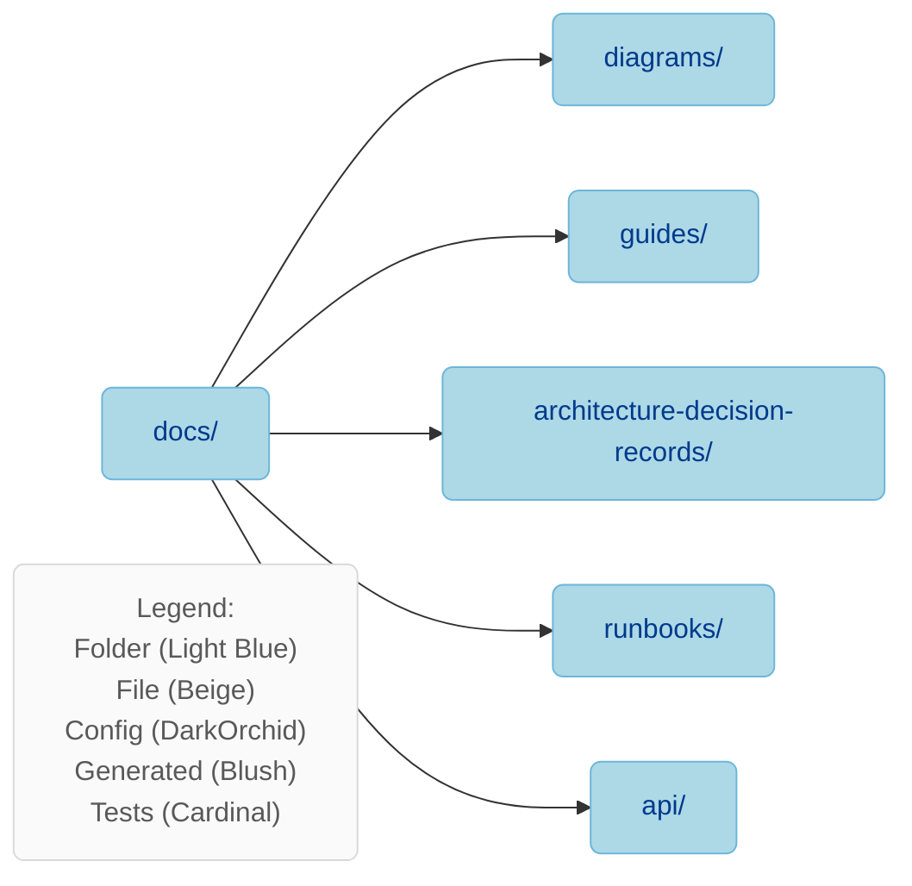

# Chapter: docs/

- Purpose: Documentation, diagrams, ADRs, guides.
- Usage: Keep developer-facing documents here; diagrams rendered via admin viewer.

```mermaid
flowchart LR
%% Palette + legibility
classDef folder fill:#ADD8E6,stroke:#6CB6D9,color:#003A8C,rx:6,ry:6;
classDef file fill:#F5F5DC,stroke:#C9C9A3,color:#262626,rx:6,ry:6;
classDef config fill:#9932CC,stroke:#6E259B,color:#FFFFFF,rx:6,ry:6;
classDef generated fill:#DE5D83,stroke:#B34463,color:#FFFFFF,rx:6,ry:6;
classDef test fill:#C41E3A,stroke:#8E1F2E,color:#FFFFFF,rx:6,ry:6;
classDef legend fill:#FAFAFA,stroke:#D9D9D9,color:#595959,rx:6,ry:6;

D["docs/"]:::folder --> D1["diagrams/"]:::folder
D --> D2["guides/"]:::folder
D --> D3["architecture-decision-records/"]:::folder
D --> D4["runbooks/"]:::folder
D --> D5["api/"]:::folder

%% Click main folder to chapter
click D "/admin/diagrams/directory-map:chapters:docs" "Open docs chapter" _blank

Legend["Legend:\nFolder (Light Blue)\nFile (Beige)\n Config (DarkOrchid)\n Generated (Blush)\nTests (Cardinal)"]:::legend
```
