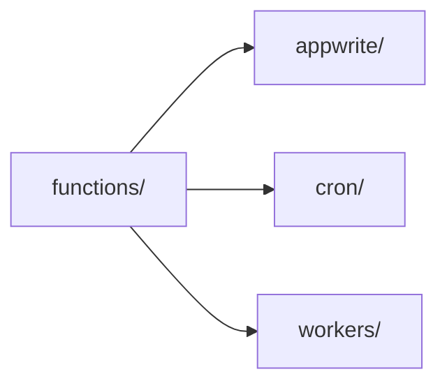

# Chapter: functions/

- Purpose: Appwrite/cron/workers functions.
- Usage: One folder per function; document triggers and I/O; keep shared bits in `functions/_shared` or import `lib/**`.

```mermaid
graph LR
  F[functions/] --> F1[appwrite/]
  F --> F2[cron/]
  F --> F3[workers/]
```
