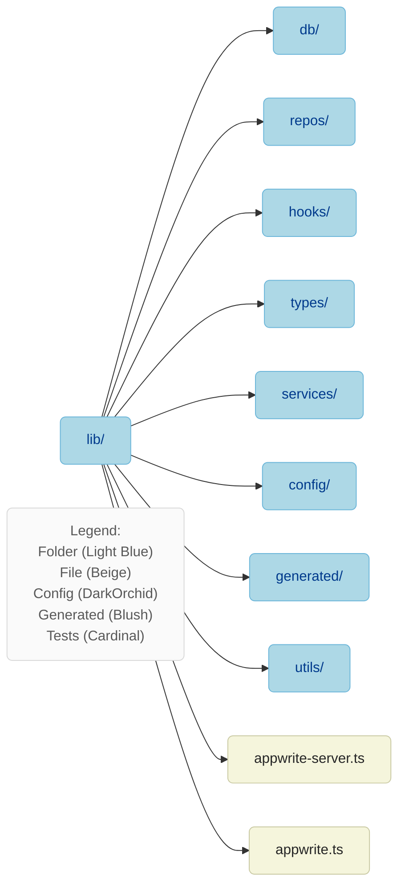

# Chapter: lib/

- Purpose: Core utilities, repositories, domain logic, and SDKs.
- Usage: Keep business logic here; avoid importing UI into `lib/*`.

Notables: `lib/repos/*`, `lib/db/*`, `lib/appwrite-*.ts`, `lib/types/*`.

