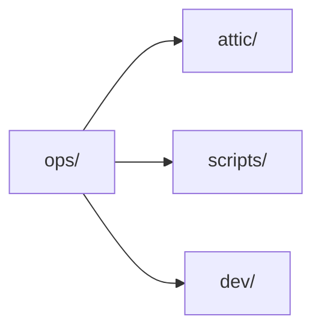

# Chapter: ops/

- Purpose: Operational scripts, diagrams, and automation.
- Usage: Put legacy in `ops/attic`; scripts in `ops/scripts`; dev helpers in `ops/dev`.

```mermaid
graph LR
  O[ops/] --> O1[attic/]
  O --> O2[scripts/]
  O --> O3[dev/]
```
