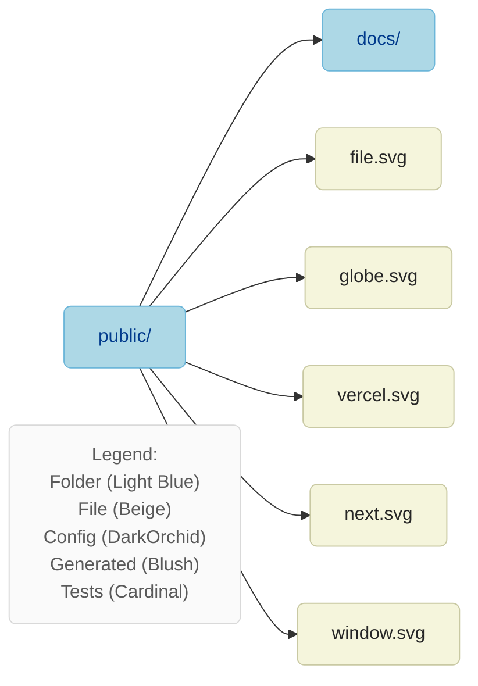

# Chapter: public/

- Purpose: Static assets served directly by Next.js.
- Usage: Store images, static docs, and public files. Avoid secrets.

```mermaid
flowchart LR
%% Palette + legibility
classDef folder fill:#ADD8E6,stroke:#6CB6D9,color:#003A8C,rx:6,ry:6;
classDef file fill:#F5F5DC,stroke:#C9C9A3,color:#262626,rx:6,ry:6;
classDef config fill:#9932CC,stroke:#6E259B,color:#FFFFFF,rx:6,ry:6;
classDef generated fill:#DE5D83,stroke:#B34463,color:#FFFFFF,rx:6,ry:6;
classDef test fill:#C41E3A,stroke:#8E1F2E,color:#FFFFFF,rx:6,ry:6;
classDef legend fill:#FAFAFA,stroke:#D9D9D9,color:#595959,rx:6,ry:6;

P["public/"]:::folder --> PD["docs/"]:::folder
P --> F1["file.svg"]:::file
P --> F2["globe.svg"]:::file
P --> F3["vercel.svg"]:::file
P --> F4["next.svg"]:::file
P --> F5["window.svg"]:::file

%% Click main folder to chapter
click P "/admin/diagrams/directory-map:chapters:public" "Open public chapter" _blank

Legend["Legend:\nFolder (Light Blue)\nFile (Beige)\n Config (DarkOrchid)\n Generated (Blush)\nTests (Cardinal)"]:::legend
```
