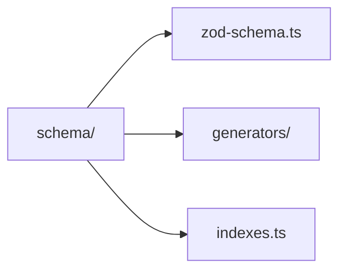

# Chapter: schema/

- Purpose: Single Source of Truth for Appwrite collections.
- Usage: Update zod schema; run generators; sync to Appwrite.

```mermaid
graph LR
  S[schema/] --> S1[zod-schema.ts]
  S --> S2[generators/]
  S --> S3[indexes.ts]
```
