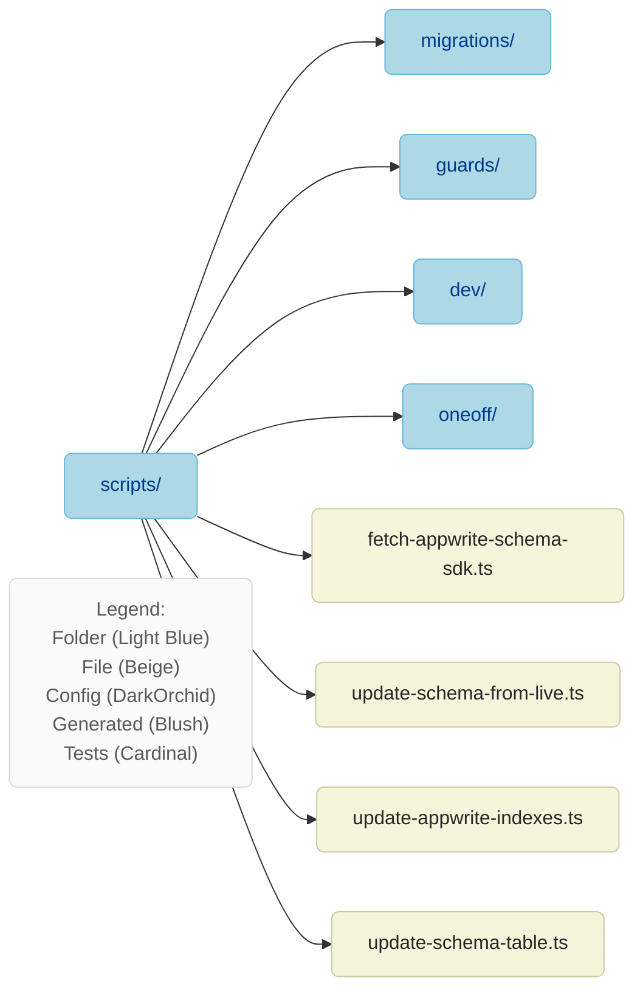

# Chapter: scripts/

- Purpose: Operational and migration scripts for schema and data tasks.
- Usage: Run via npm scripts; keep one-off scripts in `oneoff/`.

```mermaid
flowchart LR
%% Palette + legibility
classDef folder fill:#ADD8E6,stroke:#6CB6D9,color:#003A8C,rx:6,ry:6;
classDef file fill:#F5F5DC,stroke:#C9C9A3,color:#262626,rx:6,ry:6;
classDef config fill:#9932CC,stroke:#6E259B,color:#FFFFFF,rx:6,ry:6;
classDef generated fill:#DE5D83,stroke:#B34463,color:#FFFFFF,rx:6,ry:6;
classDef test fill:#C41E3A,stroke:#8E1F2E,color:#FFFFFF,rx:6,ry:6;
classDef legend fill:#FAFAFA,stroke:#D9D9D9,color:#595959,rx:6,ry:6;

S["scripts/"]:::folder --> M1["migrations/"]:::folder
S --> G1["guards/"]:::folder
S --> D1["dev/"]:::folder
S --> O1["oneoff/"]:::folder
S --> F1["fetch-appwrite-schema-sdk.ts"]:::file
S --> F2["update-schema-from-live.ts"]:::file
S --> F3["update-appwrite-indexes.ts"]:::file
S --> F4["update-schema-table.ts"]:::file

Legend["Legend:\nFolder (Light Blue)\nFile (Beige)\n Config (DarkOrchid)\n Generated (Blush)\nTests (Cardinal)"]:::legend
```
