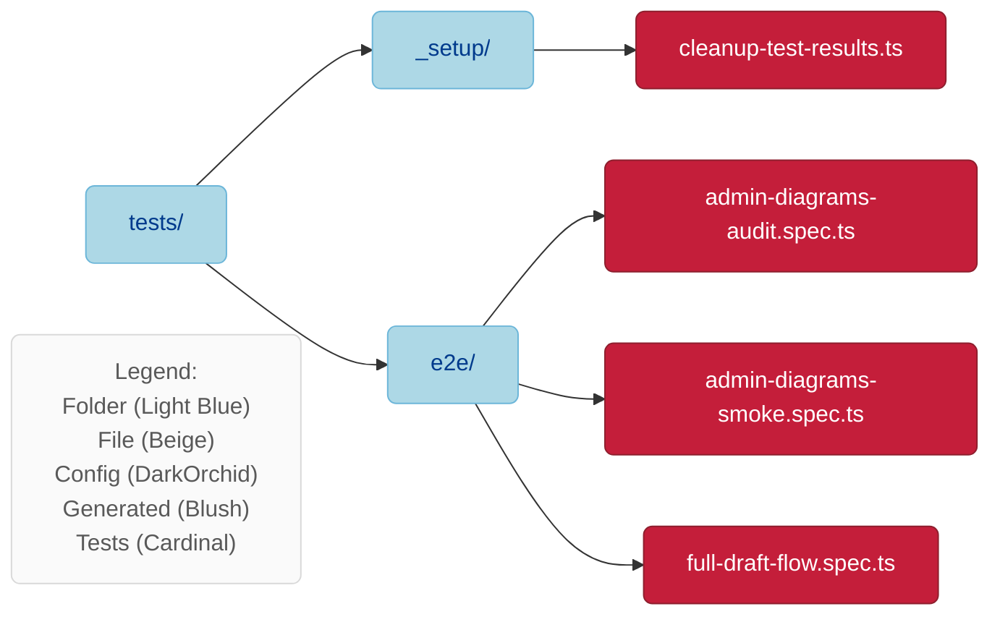

# Chapter: tests/

- Purpose: E2E and unit tests.
- Usage: Keep setup in `tests/_setup`; E2E in `tests/e2e`.

```mermaid
flowchart LR
%% Palette + legibility
classDef folder fill:#ADD8E6,stroke:#6CB6D9,color:#003A8C,rx:6,ry:6;
classDef file fill:#F5F5DC,stroke:#C9C9A3,color:#262626,rx:6,ry:6;
classDef config fill:#9932CC,stroke:#6E259B,color:#FFFFFF,rx:6,ry:6;
classDef generated fill:#DE5D83,stroke:#B34463,color:#FFFFFF,rx:6,ry:6;
classDef test fill:#C41E3A,stroke:#8E1F2E,color:#FFFFFF,rx:6,ry:6;
classDef legend fill:#FAFAFA,stroke:#D9D9D9,color:#595959,rx:6,ry:6;

T["tests/"]:::folder --> TS["_setup/"]:::folder
T --> TE["e2e/"]:::folder
TS --> F1["cleanup-test-results.ts"]:::test
TE --> F2["admin-diagrams-audit.spec.ts"]:::test
TE --> F3["admin-diagrams-smoke.spec.ts"]:::test
TE --> F4["full-draft-flow.spec.ts"]:::test

Legend["Legend:\nFolder (Light Blue)\nFile (Beige)\n Config (DarkOrchid)\n Generated (Blush)\nTests (Cardinal)"]:::legend
```
