# Directory Map — Overview

This section documents the repository structure in a doc-first format with:

- Table of contents of root folders (chapters)
- A brief description of each folder's responsibilities and usage patterns
- A diagrams area (Mermaid) to visualize structure
- Deep links to important files with overlays in the admin UI

```mermaid
flowchart TB
%% Palette + legibility
classDef folder fill:#ADD8E6,stroke:#6CB6D9,color:#003A8C,rx:6,ry:6;
classDef file fill:#F5F5DC,stroke:#C9C9A3,color:#262626,rx:6,ry:6;
classDef config fill:#9932CC,stroke:#6E259B,color:#FFFFFF,rx:6,ry:6;
classDef generated fill:#DE5D83,stroke:#B34463,color:#FFFFFF,rx:6,ry:6;
classDef test fill:#C41E3A,stroke:#8E1F2E,color:#FFFFFF,rx:6,ry:6;
classDef legend fill:#FAFAFA,stroke:#D9D9D9,color:#595959,rx:6,ry:6;

R["Repo Root"]:::folder
R --> A["app/"]:::folder
R --> C["components/"]:::folder
R --> L["lib/"]:::folder
R --> D["docs/"]:::folder
R --> F["functions/"]:::folder
R --> S["schema/"]:::folder
R --> O["ops/"]:::folder
R --> P["public/"]:::folder
R --> Y["styles/"]:::folder
R --> T["tests/"]:::folder
R --> DT["data/"]:::folder
R --> SC["scripts/"]:::folder
R --> V["vendor/"]:::folder

%% Click directives for main chapters
click A "/admin/diagrams/directory-map:chapters:app" "Open chapter: app/" _blank
click C "/admin/diagrams/directory-map:chapters:components" "Open chapter: components/" _blank
click L "/admin/diagrams/directory-map:chapters:lib" "Open chapter: lib/" _blank
click D "/admin/diagrams/directory-map:chapters:docs" "Open chapter: docs/" _blank
click F "/admin/diagrams/directory-map:chapters:functions" "Open chapter: functions/" _blank
click S "/admin/diagrams/directory-map:chapters:schema" "Open chapter: schema/" _blank
click P "/admin/diagrams/directory-map:chapters:public" "Open chapter: public/" _blank

Legend["Legend:\nFolder (Light Blue)\nFile (Beige)\n Config (DarkOrchid)\n Generated (Blush)\nTests (Cardinal)"]:::legend
```

