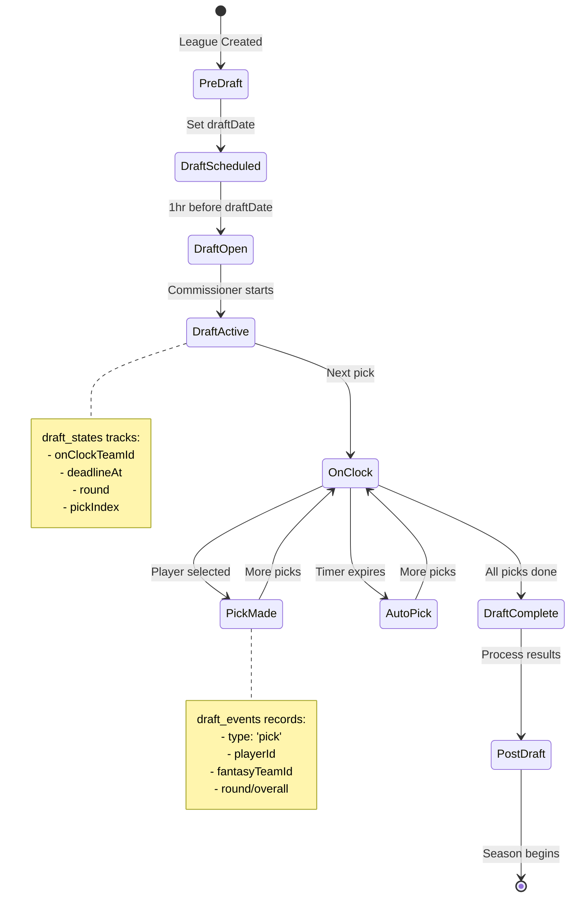

# Draft System Schema (Live Appwrite)

Updated: 2025-01-03

## Draft-Related Collections

```mermaid
erDiagram
    drafts ||--o{ draft_events : "has"
    drafts ||--o{ draft_picks : "records"
    drafts ||--|| draft_states : "has state"
    drafts ||--o{ fantasy_teams : "involves"
    fantasy_teams ||--o{ roster_slots : "owns"
    draft_picks ||--o| college_players : "selects"
    draft_events ||--o| college_players : "picks"
    leagues ||--|| drafts : "schedules"

    drafts {
        string leagueId
        string draftStatus
        int currentRound
        int currentPick
        int maxRounds
        string draftOrder
        datetime startTime
        datetime endTime
        string type
        int clockSeconds
        string orderJson
        boolean isMock
        string leagueName
        string gameMode
        string selectedConference
        int maxTeams
        string scoringRules
        string stateJson
        string eventsJson
        string picksJson
        string onTheClock
        datetime lastPickTime
    }

    draft_states {
        string draftId PK
        string onClockTeamId
        datetime deadlineAt
        int round
        int pickIndex
        string draftStatus
    }

    draft_events {
        string draftId FK
        string type
        int round
        int overall
        string fantasyTeamId
        string playerId
        datetime ts
        string payloadJson
    }

    draft_picks {
        string leagueId FK
        string draftId FK
        string playerId FK
        string authUserId
        string fantasyTeamId
        int round
        int pick
        int overallPick
        datetime timestamp
        string playerName
        string playerPosition
        string playerTeam
        string playerConference
        string teamName
    }

    fantasy_teams {
        string leagueId FK
        string teamName
        string abbrev
        string logoUrl
        int wins
        int losses
        int ties
        double pointsFor
        double pointsAgainst
        int draftPosition
        double auctionBudgetTotal
        double auctionBudgetRemaining
        string displayName
        string ownerAuthUserId
        string leagueName
        string players
    }

    roster_slots {
        string fantasyTeamId FK
        string playerId FK
        string position
        string acquiredVia
        datetime acquiredAt
    }

    college_players {
        string $id PK
        string name
        string position
        string team
        string conference
        string year
        int jerseyNumber
        string height
        int weight
        boolean eligible
        boolean draftable
        double fantasyPoints
        double seasonFantasyPoints
        int depthChartOrder
        string schoolId
        string classYear
        string cfbdId
        string espnId
    }

    leagues {
        string $id PK
        string leagueName
        int season
        int maxTeams
        string leagueStatus
        string gameMode
        string draftType
        boolean isPublic
        int currentTeams
        int pickTimeSeconds
        datetime draftDate
        string selectedConference
        int seasonStartWeek
        int playoffTeams
        int playoffStartWeek
        string waiverType
        int waiverBudget
        string password
        string commissionerAuthUserId
        string scoringRules
        string draftOrder
        string phase
        string engineVersion
    }
```

## Draft Flow State Machine



## Key Schema Alignments

### Collection ID Mappings (Live)

- `drafts` - Main draft configuration
- `draft_states` - Real-time draft state (document security enabled)
- `draft_events` - Draft event log
- `fantasy_teams` - Teams in the draft
- `roster_slots` - Drafted players
- `college_players` - Available player pool
- `leagues` - League configuration

### Important Attributes

#### drafts Collection

- `isMock` (boolean) - Distinguishes mock vs real drafts
- `stateJson` (string, 1MB) - Complete draft state
- `eventsJson` (string, 1MB) - All draft events
- `picksJson` (string, 1MB) - All picks made
- `onTheClock` (string) - Current picking team
- `lastPickTime` (datetime) - Timestamp of last pick

#### draft_states Collection

- **Document Security**: ENABLED (only collection with this)
- `draftStatus` (string, default: 'pre-draft')
- Unique index on `draftId`
- Index on `[draftStatus, deadlineAt]` for deadline scanning

#### draft_events Collection

- `payloadJson` (string, 8KB) - Event details
- Indexed by `[draftId, overall]` and `[draftId, ts]`

#### draft_picks Collection

- Records individual draft selections
- `leagueId`, `draftId` - Links to league and draft
- `playerId`, `authUserId`, `fantasyTeamId` - Player and team associations
- `round`, `pick`, `overallPick` - Draft position tracking
- `playerName`, `playerPosition`, `playerTeam`, `playerConference` - Denormalized player info
- `timestamp` - When the pick was made
- `teamName` - Fantasy team that made the pick

#### fantasy_teams Collection

- Unique constraint: `[leagueId, ownerAuthUserId]`
- 5 indexes for efficient queries

#### roster_slots Collection

- Links `fantasyTeamId` to `playerId`
- `acquiredVia` tracks how player was obtained
- `acquiredAt` timestamp

## API Endpoints Alignment

```yaml
/api/draft:
  /players:
    GET: Returns college_players filtered by eligibility

  /[draftId]:
    GET: Returns draft + draft_states
    POST: Updates draft_states

  /[draftId]/pick:
    POST:
      - Creates draft_picks record
      - Creates draft_events entry
      - Updates draft_states
      - If not mock: Creates roster_slots entry

  /[draftId]/autopick:
    POST:
      - Triggered when deadlineAt expires
      - Same as /pick but with type: 'auto'
```

## Real-time Subscriptions

```javascript
// Subscribe to draft state changes
appwrite.subscribe(
  [
    'databases.college-football-fantasy.collections.draft_states.documents',
    'databases.college-football-fantasy.collections.draft_events.documents',
    'databases.college-football-fantasy.collections.draft_picks.documents',
  ],
  response => {
    // Handle real-time updates
  }
)
```

## Mock vs Real Draft Differences

| Aspect                          | Mock Draft | Real Draft |
| ------------------------------- | ---------- | ---------- |
| `isMock`                        | true       | false      |
| Creates `roster_slots`          | ❌         | ✅         |
| Creates `transactions`          | ❌         | ✅         |
| Updates `fantasy_teams.players` | ❌         | ✅         |
| Saves to `draft_events`         | ✅         | ✅         |
| Real-time updates               | ✅         | ✅         |
| Timer enforcement               | Optional   | Required   |
| Commissioner controls           | Limited    | Full       |
