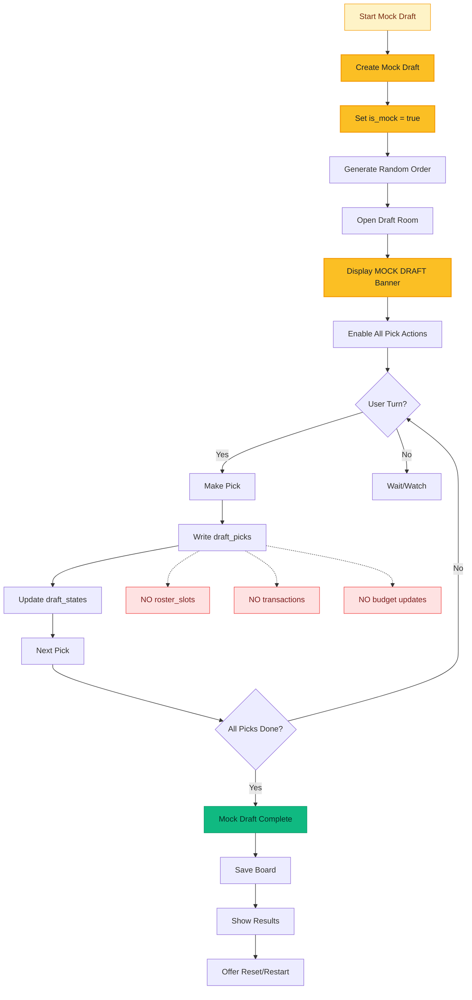

# Mock Draft Flow (Practice Mode)

```mermaid
flowchart TD
  classDef primary fill:#fbbf24,stroke:#f59e0b,color:#1a202c,stroke-width:2
  classDef good fill:#10b981,stroke:#059669,color:#062e26
  classDef warn fill:#fef3c7,stroke:#f59e0b,color:#7c2d12
  classDef none fill:#fee2e2,stroke:#ef4444,color:#7f1d1d

  A[Start Mock Draft]:::warn --> B[Create Mock Draft]:::primary
  B --> C[Set is_mock = true]:::primary
  C --> D[Generate Random Order]
  D --> E[Open Draft Room]

  E --> F[Display MOCK DRAFT Banner]:::primary
  F --> G[Enable All Pick Actions]

  G --> H{User Turn?}
  H -->|Yes| I[Make Pick]
  H -->|No| J[Wait/Watch]

  I --> K[Write draft_picks]
  K --> L[Update draft_states]
  L --> M[Next Pick]

  M --> N{All Picks Done?}
  N -->|No| H
  N -->|Yes| O[Mock Draft Complete]:::good

  O --> P[Save Board]
  P --> Q[Show Results]
  Q --> R[Offer Reset/Restart]

  S[NO roster_slots]:::none
  T[NO transactions]:::none
  U[NO budget updates]:::none

  K -.-> S
  K -.-> T
  K -.-> U
```
