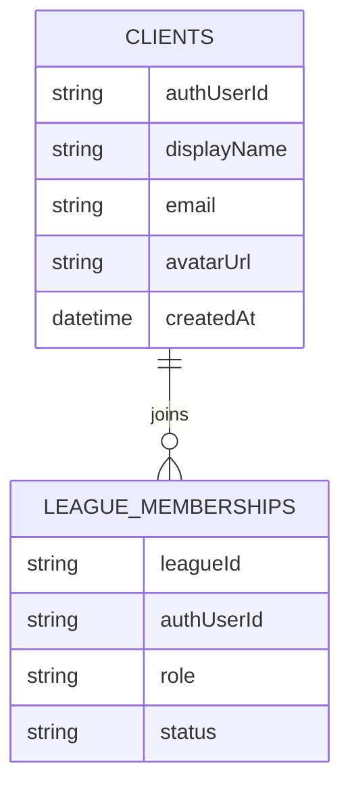

# Auth Entity Relation

Collections:

- clients: authUserId (unique), displayName, email, avatarUrl, createdAt
- league_memberships: leagueId, authUserId, role, status

Relationships:

- clients (1) → (many) league_memberships

Related: ../overview/auth.md

