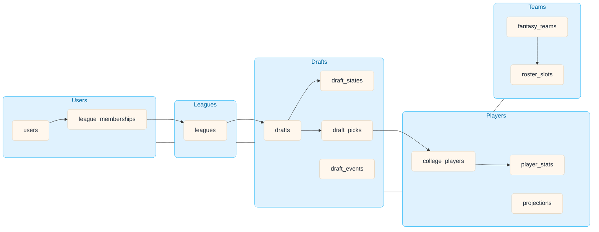

# Core Data & Entity Relation (Project)

Core collections and relationships across domains.

- Users (clients), league_memberships, leagues
- Drafts: drafts, draft_states, draft_picks, draft_events
- Players: college_players, player_stats, schools, projections
- Teams: fantasy_teams, roster_slots

Keep detailed ER per domain in their domain folders.
