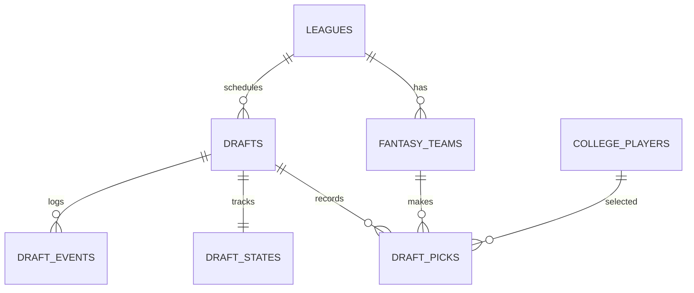

# Draft Entity Relation

Core collections:
- drafts (config), draft_states (realtime), draft_picks (history), draft_events (audit)
- leagues, fantasy_teams, college_players, roster_slots

Key relationships:
- drafts (1) → (1) draft_states
- drafts (1) → (many) draft_picks
- leagues (1) → (many) fantasy_teams
- fantasy_teams (1) → (many) draft_picks
- college_players (1) → (many) draft_picks

Related: ../overview/draft.md

