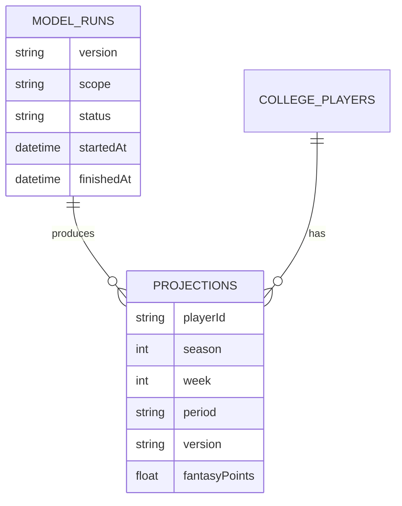

# Projections Entity Relation

Collections:

- projections: playerId, season, week, period, version, fantasyPoints, componentsJson
- model_runs: version, scope, status, startedAt, finishedAt, metricsJson
- college_players: fantasyPoints (canonical field)

Relationships:

- model_runs (1) → (many) projections
- college_players (1) → (many) projections

Related: ../overview/projections.md

