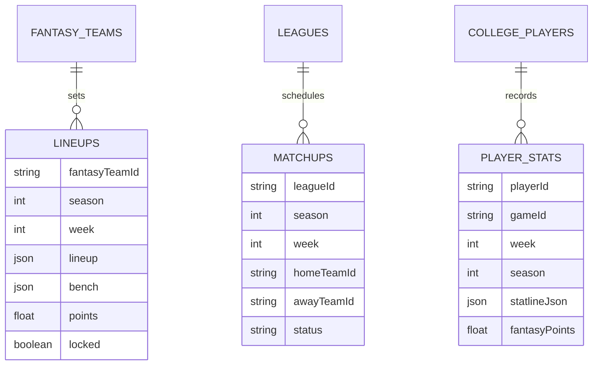

# Scoring Entity Relation

Collections:

- lineups: fantasyTeamId, season, week, lineup, bench, points, locked
- matchups: leagueId, season, week, homeTeamId, awayTeamId, status
- player_stats: playerId, gameId, week, season, statlineJson, fantasyPoints

Relationships:

- fantasy_teams (1) → (many) lineups
- leagues (1) → (many) matchups
- college_players (1) → (many) player_stats

Eligibility: AP Top-25 or conference games only.

Related: ../overview/scoring.md

