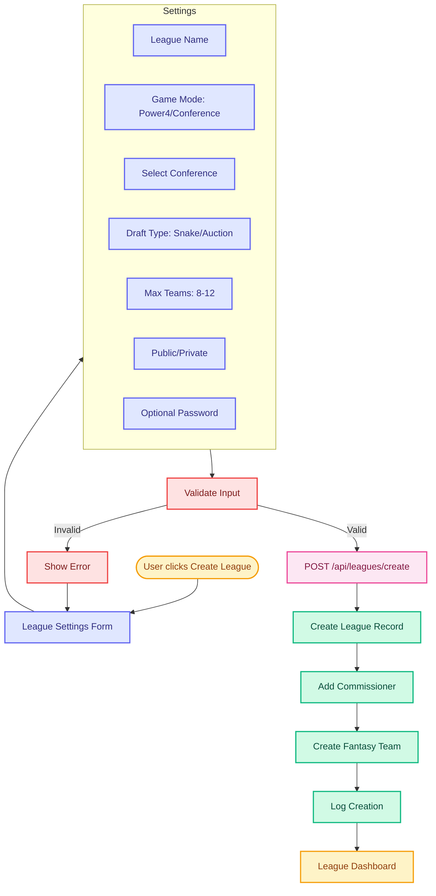
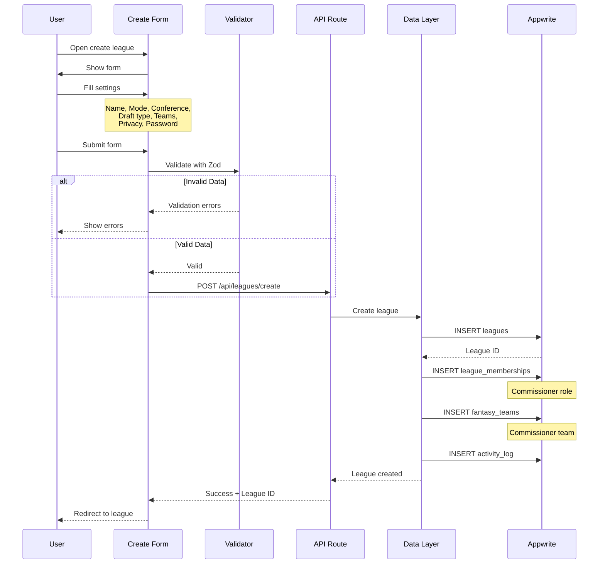

# Create League Flow

## Overview
League creation flow with configuration options and automatic commissioner assignment.

## Related Files
- `/app/api/leagues/create/route.ts` - League creation API
- `/app/(dashboard)/league/create/page.tsx` - Create league UI
- `/lib/db/leagues.ts` - League DAL
- `/lib/db/league_memberships.ts` - Membership DAL
- `/schema/zod/leagues.ts` - League validation schema

## User Flow

## Sequence Diagram

## Data Interactions

| Collection | Operation | Attributes Set | Notes |
|------------|-----------|---------------|-------|
| `leagues` | CREATE | `name`, `game_mode`, `selected_conference`, `draft_type`, `max_teams`, `is_public`, `password`, `commissioner_id`, `status`, `created_at` | Main league record |
| `league_memberships` | CREATE | `league_id`, `client_id`, `role=commissioner`, `status=active`, `joined_at` | Add creator as commissioner |
| `fantasy_teams` | CREATE | `league_id`, `owner_client_id`, `name`, `created_at` | Create commissioner's team |
| `activity_log` | CREATE | `action=league_created`, `league_id`, `client_id`, `metadata` | Track creation event |
| `invites` | CREATE* | `league_id`, `invite_code`, `expires_at` | *If private league |

## Validation Rules

### Required Fields
- League name (3-50 characters)
- Game mode (power4 or conference)
- If conference mode: selected conference (SEC/ACC/Big12/BigTen)
- Draft type (snake or auction)
- Max teams (8-12)

### Business Rules
- User must be authenticated
- User can create max 5 leagues per season
- League name must be unique within season
- Private leagues require password (min 6 chars)
- Draft date must be future date
- Game mode and conference are immutable after creation

## Error States
- `400` - Invalid input data
- `401` - User not authenticated
- `409` - League name already exists
- `429` - Too many leagues created
- `500` - Database error
