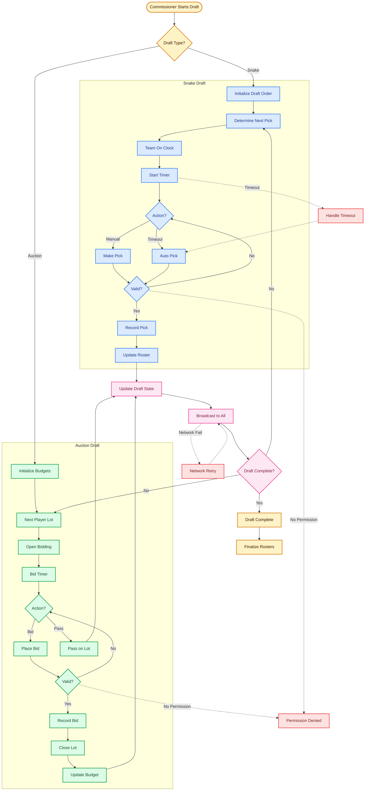
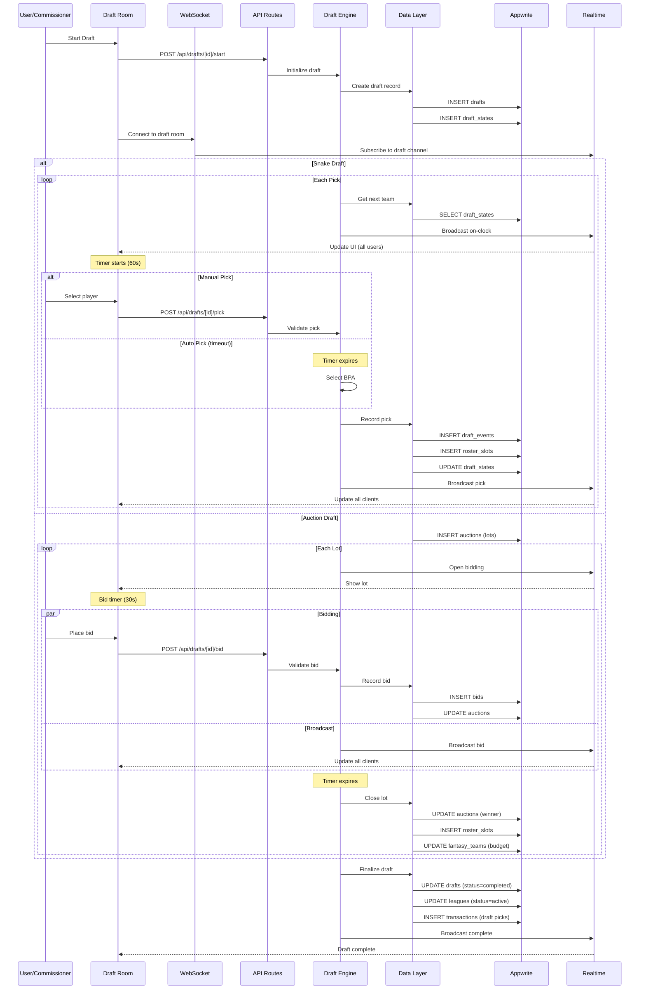

# Draft Flow (Snake & Auction)

## Overview
Comprehensive draft system supporting both snake drafts and auction drafts with real-time updates.

## Related Files
- `/app/api/drafts/[id]/start/route.ts` - Start draft
- `/app/api/drafts/[id]/pick/route.ts` - Make pick (snake)
- `/app/api/drafts/[id]/bid/route.ts` - Place bid (auction)
- `/app/api/drafts/[id]/state/route.ts` - Get/update draft state
- `/app/draft/[leagueId]/page.tsx` - Draft room UI
- `/lib/draft/engine.ts` - Core draft logic
- `/lib/db/drafts.ts` - Draft DAL
- `/lib/realtime/draft.ts` - WebSocket handlers

## Draft Flow


## Sequence Diagram


## Data Interactions

| Collection | Read/Write | When | Attributes | Notes |
|------------|------------|------|------------|-------|
| **Draft Setup** | | | | |
| `drafts` | CREATE | Start | `league_id`, `type`, `status`, `start_time` | Initialize draft |
| `drafts` | READ | Throughout | All | Check draft config |
| `drafts` | UPDATE | Complete | `status`, `end_time` | Mark as completed |
| `draft_states` | CREATE | Start | `draft_id`, `round=1`, `pick=1`, `on_clock_team_id` | Initial state |
| `draft_states` | READ | Each turn | `on_clock_team_id`, `deadline_at` | Get current pick |
| `draft_states` | UPDATE | Each pick | `round`, `pick`, `on_clock_team_id`, `deadline_at` | Advance draft |
| **Snake Draft** | | | | |
| `draft_events` | CREATE | Each pick | `draft_id`, `type=pick`, `round`, `overall`, `fantasy_team_id`, `player_id`, `ts` | Record pick |
| `draft_events` | READ | UI update | All | Show pick history |
| `roster_slots` | CREATE | Each pick | `fantasy_team_id`, `player_id`, `position`, `acquisition_type=draft` | Add to roster |
| `college_players` | READ | Pick validation | `id`, `position`, `eligible` | Validate player |
| `college_players` | UPDATE | After pick | `drafted=true` | Mark as drafted |
| **Auction Draft** | | | | |
| `auctions` | CREATE | Each lot | `league_id`, `player_id`, `status=open`, `current_bid=0` | Open lot |
| `auctions` | READ | Bidding | `current_bid`, `current_bidder_id`, `ends_at` | Show current bid |
| `auctions` | UPDATE | Each bid | `current_bid`, `current_bidder_id` | Update high bid |
| `auctions` | UPDATE | Timer end | `status=closed`, `winner_id`, `final_price` | Close lot |
| `bids` | CREATE | Each bid | `auction_id`, `fantasy_team_id`, `amount`, `timestamp` | Record bid |
| `bids` | READ | History | All | Show bid history |
| `fantasy_teams` | READ | Validation | `auction_budget_remaining` | Check budget |
| `fantasy_teams` | UPDATE | Won lot | `auction_budget_remaining` | Deduct cost |
| **Common** | | | | |
| `transactions` | CREATE | Each action | `type=draft/auction`, `fantasy_team_id`, `player_id` | Audit trail |
| `activity_log` | CREATE | Key events | `action`, `league_id`, `client_id`, `metadata` | Track activity |
| `league_memberships` | READ | Validation | `league_id`, `client_id`, `role` | Check permissions |

## Points of Failure & Mitigation

### Network Issues
- **Problem**: WebSocket disconnection during draft
- **Mitigation**: 
  - Auto-reconnect with exponential backoff
  - Persist draft state in DB every action
  - Allow rejoin with state recovery
  - Queue actions during disconnect

### Timeouts
- **Problem**: User doesn't pick in time
- **Mitigation**:
  - Auto-pick best available player
  - Pre-draft rankings per team
  - Commissioner can pause/extend timer
  - Warning notifications at 10s remaining

### Permission Errors
- **Problem**: Wrong user trying to pick
- **Mitigation**:
  - Server-side validation of on_clock_team_id
  - Role-based access (commissioner override)
  - Signed WebSocket messages
  - Rate limiting per user

### Data Conflicts
- **Problem**: Simultaneous picks/bids
- **Mitigation**:
  - Database transactions
  - Optimistic locking on draft_states
  - Unique constraints on roster_slots
  - Bid validation against current state

### Recovery Procedures
```typescript
// Automatic retry with backoff
const retry = async (fn, retries = 3, delay = 1000) => {
  try {
    return await fn()
  } catch (error) {
    if (retries === 0) throw error
    await new Promise(r => setTimeout(r, delay))
    return retry(fn, retries - 1, delay * 2)
  }
}

// State recovery on reconnect
const recoverDraftState = async (draftId) => {
  const state = await getDraftState(draftId)
  const events = await getDraftEvents(draftId)
  return reconstructState(state, events)
}
```
